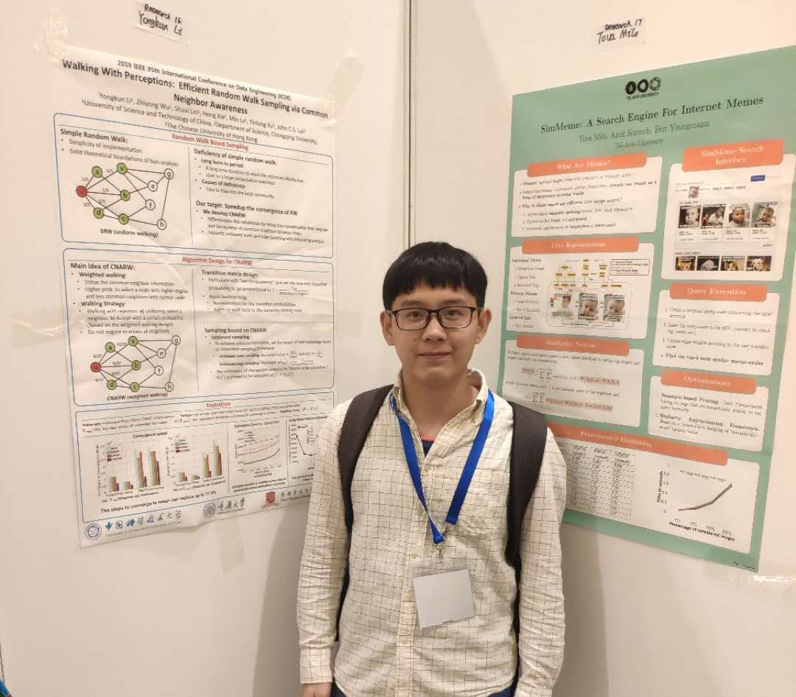

近期，在实验室老师、同学们和其他合作者们的共同努力下，ADSL 又有三项成果分别发表在计算机系统领域重要国际会议USENIX ATC(CCF A类)、数据库领域重要国际会议ICDE(CCF A类)，并行与分布式计算领域重要国际会议IPDPS(CCF B类)上。

首先，向各位参与研究工作的老师、同学、合作者表示祝贺，并感谢你们一直以来的辛勤付出！

三项成果分别涉及键值存储系统、图算法、数据的故障恢复，摘要如下：

论文一：ElasticBF: Elastic Bloom Filter with Hotness Awareness for Boosting Read Performance in Large Key-Value Stores. Yongkun Li, Chengjin Tian, Fan Guo, Cheng Li, and Yinlong Xu, University of Science and Technology of China. To appear in the Proceedings of  USENIX ATC 2019. RENTON, WA, USA.

概要：键值存储系统主要采用基于分层结构的LSM-tree作为底层存储引擎，系统在执行读操作时，需要发出多个I/O请求对不同层的数据进行检查，过多I/O请求会导致读性能变差。键值存储系统通常使用布隆过滤器技术来减少额外的I/O请求以提高读性能，但是布隆过滤器存在误报，简单地采用更大的布隆过滤器会带来巨大的内存开销，因此在内存受限的系统中使用布隆过滤器仍然会带来额外的I/O。在这个工作中，我们观察到访问不均衡性在SSTable间以及在SSTable内部是十分常见的，为了利用这个特征，我们提出了一种细粒度异构的布隆过滤器管理方案：ElasticBF，该方案能够根据数据热度动态地将布隆过滤器从磁盘加载到内存。ElasticBF与已有的优化键值存储系统架构的工作是正交的关系，能够被集成到这些工作从而进一步优化它们的读性能。我们在LevelDB，RocksDB和PebblesDB上实现了ElasticBF，实验结果表明ElasticBF能够分别提升2.34倍，2.35倍和2.58倍的读性能，并且保持几乎一样的写性能和范围查询性能。

论文二： Walking with perceptions: efficient random walk sampling via common neighbor awareness. Yongkun Li, Zhiyong Wu, Shuai Lin, Hong Xie, Min Lv, Yinlong Xu, John C. S. Lui. To appear in the Proceedings of  ICDE 2019. Macau, China.

概要：由于随机游走的简单性以及有严格的理论体系，其被大量运用到超大图的采样当中。然而，基于随机游走的收敛速度很慢，这严重影响了它的计算效率。为了解决这一问题，我们提出了一种基于公共邻居感知的随机游走框架，CNARW，它通过一种带权随机游走来加速收敛速度。具体来说，CNARW考虑了当前访问节点与下一候选节点之间的公共邻居来设计下一步随机游走的权重。基于CNARW，还可以做图上的”无偏估计”。最后我们在真实数据集上进行实验验证，实验结果表明，CNARW与其他算法相比可以实现更快的收敛速度，在相同的访问开销上可以实现更精准的采样精确度。

论文三：D^3: Deterministic Data Distribution for Efficient Data Reconstruction in Erasure-Coded Distributed Storage Systems. Zhipeng Li, Min Lv, Yinlong Xu, Yongkun Li, Liangliang Xu. To appear in the Proceedings of  IPDPS 2019. Rio de Janeiro, Brazil.
概要：大型分布式存储系统中部署了大量独立而且可能并不可靠的组件，因此设备故障十分普遍。纠删码广泛应用于实际存储系统中，以提供低存储开销的容错能力。然而，在基于纠删码的分布式存储系统中，常用的随机数据放置策略会导致大量的跨机架传输、负载不均衡与随机访问，从而降低了故障修复的速度。本文提出了一种面向高效故障修复的确定性数据布局方案D^3（Deterministic Data Distribution），以及基于D^3数据布局的故障修复算法。D^3利用正交阵列（Orthogonal Array）来定义块在机架和节点之间的放置。D^3不仅在节点之间均匀地分布了数据块与校验块，而且实现了在故障修复时，修复流量分别在机架和节点之间均匀分布。此外，对于一个可容单机架故障的数据布局，在D^3数据布局下，修复一个节点故障所需跨机架访问的块的数量达到了最小。在实际分布式存储系统中的实验结果表明，D^3可以显著加快故障修复过程。

同时，实验室研一同学林帅赴澳门参加了ICDE会议并在会上关于实验室论文: “Walking with perceptions: efficient random walk sampling via common neighbor awareness.“做了汇报与展示，并且在Poster展区解答对论文感兴趣的学者的提问。他表示，此次会议对他来说具有非常重要的意义，不仅聆听到世界学术大牛的精彩演讲，在与他们的交流之中也获得了很多宝贵的意见。

再次感谢实验室各位老师、同学以及合作者的不懈努力，希望ADSL的各位成员能够继续不断前行，在计算机系统的高峰上不断攀登！

