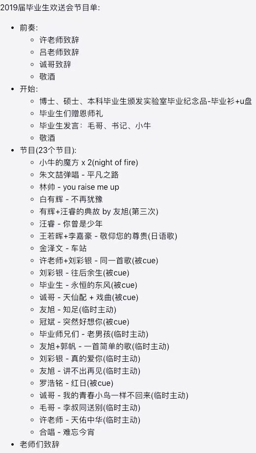

2019年6月15日，实验室又有一批同学即将毕业离开校园，走向远方，为送别与我们一起经历风雨，为实验室做出贡献的毕业生们，ADSL为19届毕业生举办联欢晚会。

联欢晚会由许老师以及各位老师的致辞拉开序幕，许老师以及吕老师代表实验室为各位毕业生送上ADSL实验室的纪念礼物，同学们表达了对老师们的诚挚感谢以及对实验室发展的美好祝愿。

晚会开始后，同学们为大家献上了精心准备的魔方秀、吉他弹唱、歌曲串烧、戏曲联唱等20多个节目，整个晚会的气氛都被点燃，同学们载歌载舞，在欢声笑语中表达着自己的感动，留念，以及热切的期盼与祝福。

晚会的最后在永恒的东方、送别、天佑中华以及难忘今宵的歌声中落下帷幕，送别晚会虽然结束了，但是毕业生们新的人生旅途才刚刚开始，无论他们身处何方，ADSL都诚挚地祝福他们前程似锦，离开校园后能通过自己的所学，贡献出自己的光与热，书写一份属于自己的精彩！

