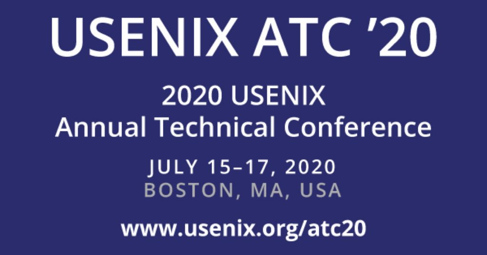
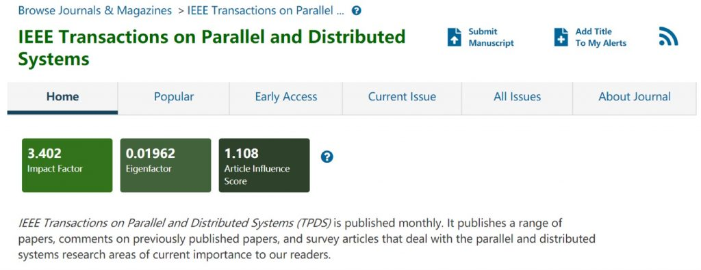
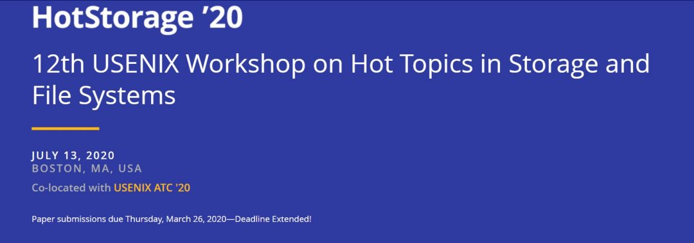

在做好疫情防控工作的同时，ADSL不忘科研工作，在实验室老师、同学及其他合作者的共同努力下，近期本实验室又有四项成果分别被计算机系统顶级会议 **ATC**、通信网络顶级会议 **INFOCOM**、系统结构领域顶级期刊**TPDS**和存储领域重要workshop **HotStorage**收录，向所有合作者、参研老师和同学表示祝贺！也向他们表示衷心感谢！

这四项成果分别涉及系统研究领域中的的**图系统**与**纠删码**两个重要热点，以下是论文介绍：

论文一：

Rui Wang, Yongkun Li, Hong Xie, Yinlong Xu, John C. S. Lui, GraphWalker: An I/O-Efficient and Resource-Friendly Graph Analytic System for Fast and Scalable Random Walks, ATC20

摘要：

传统的图系统主要采用基于迭代的模型来迭代地加载图数据库进入内存进行分析处理，以此减少随机I/O。但是这种基于迭代的模型在支持基于随机游走的应用时体现出受限的效率和可扩展性。本文提出一个专门为随机游走设计的I/O高效的图系统GraphWalker，采用一种新奇的基于walk状态感知的I/O模型和一种异步的walk更新方式，来加速随机游走的执行。GraphWalker可以仅使用一台普通的机器来高效地处理含数千亿条边的磁盘驻留图，也可以高效并发地运行数百亿条成千上万步的随机游走。我们实现的原型系统上的实验表明，GraphWalker对比于专有的随机游走系统DrunkardMob和最新的单机图处理系统Graphene和GraFSoft，都能实现超过一个数量级的性能提升。另外，对比于最新的运行于一个分布式集群的专有的随机游走系统KnightKing，GraphWalker仅使用一台机器就能实现相当的性能，因此GraphWalker是一个更具有成本效益的选择。

论文二：PDL: A Data Layout towards Fast Failure Recovery for Erasure-coded Distributed Storage Systems. Liangliang Xu, Min Lv, Zhipeng Li, Cheng Li and Yinlong Xu. University of Science and Technology of China. To appear in the Proceedings of IEEE International Conference on Computer Communications (INFOCOM 2020), Virtual Conference.

概要：纠删码在分布式存储系统(DSSes)中越来越受欢迎，因为它以低的存储开销提供了高可靠性。然而，传统的随机数据放置方式在故障恢复过程中会造成大量的跨机架流量和严重的负载不平衡，严重影响恢复性能。此外，在DSS中共存的各种纠删码策略加剧了上述问题。在本文中，我们提出了一种基于成对平衡设计（PBD）的数据布局PDL来优化DSSes中的故障恢复性能。基于PBD组合设计的性质，PDL给出了统一的数据布局。在此基础上，提出了一种基于rPDL的故障恢复方案。rPDL通过均匀选择替代节点和检索确定的可用块来恢复丢失的块，有效地减少了跨机架流量，并提供了几乎平衡的跨机架流量分布。我们在Hadoop 3.1.1中实现了PDL和rPDL。实验结果表明，与现有的HDFS数据布局相比，rPDL平均减少了62.83%的降级读延迟，提供了6.27倍的数据恢复吞吐量，为前端应用提供了更好的支持。

论文三：Deterministic Data Distribution for Efficient Recovery in Erasure-Coded Distributed Storage Systems. Liangliang Xu, Min Lyu, Zhipeng Li, Yongkun Li and Yinlong Xu. University of Science and Technology of China. IEEE Transactions on Parallel and Distributed Systems (TPDS 2020) accepted.

概要：由于单个不可靠的商品组件，故障在大型分布式存储系统中很常见。纠删码广泛应用于实际的存储系统中，以提供低存储开销的容错能力。然而，随机数据分布(RDD)通常用于纠删码存储系统，它会导致严重的跨机架流量、负载不平衡和随机访问，从而对故障恢复产生不利影响。在本文中，利用正交矩阵，定义了确定性数据分布(D3)，使数据/校验块均匀分布于节点之间，并提出了一种基于D3的高效故障恢复方法，使单节点故障下的跨机架修复流量最小化。由于D3的均匀性，所提出的恢复方法不仅可以平衡机架内节点之间的修复流量，还可以平衡机架之间的修复流量。我们在有28台节点的Hadoop分布式文件系统(HDFS)中实现了基于D3的Reed-Solomon 码和Locally Repairable Codes码。与RDD相比，我们的实验表明，D3显著提高了RS码的故障恢复速度，达到了2.49倍；并降低了LRCs的故障恢复速度，达到了1.38倍。此外，D3在正常和恢复状态下都比RDD更好地支持前端应用程序。

论文四：SelectiveEC: Selective Reconstruction in Erasure-coded Storage Systems. Liangliang Xu, Min Lyu, Qiliang Li, Lingjiang Xie and Yinlong Xu. University of Science and Technology of China. To appear in the Proceedings of 12th USENIX Workshop on Hot Topics in Storage and File Systems (HotStorage 2020), BOSTON, MA, USA.

概要：纠删码是一种以低存储成本提供高可靠性的通用存储策略。但是，在一批的重构任务中，倾斜的负载严重减慢了存储系统的故障恢复过程。为此，我们提出了一个平衡的调度模块SelectiveEC，它通过动态地选择一批的重构任务，并为每个重构任务选择源节点和替代节点，从而打乱重构任务的顺序。因此，在纠删码存储系统中，它实现了针对单节点故障的网络恢复流量、计算资源和磁盘I/Os的负载均衡。在我们的模拟实验中，与传统的随机重构相比，SelectiveEC将恢复过程的并行度提高到106%，平均提高97%。因此，SelectiveEC不仅加快了恢复过程，而且减少了故障恢复对前端应用程序的干扰。

除了上述四项被接受的成果外，近期也有其他成果虽然投稿被拒，但值得欣慰的是，每一篇稿件都收获了同行业国际专家不同程度的认可，以及极富建设性的修改意见。希望ADSL的同学们继续努力不断进步，完善自己的工作以获得更多、更好的成果。
