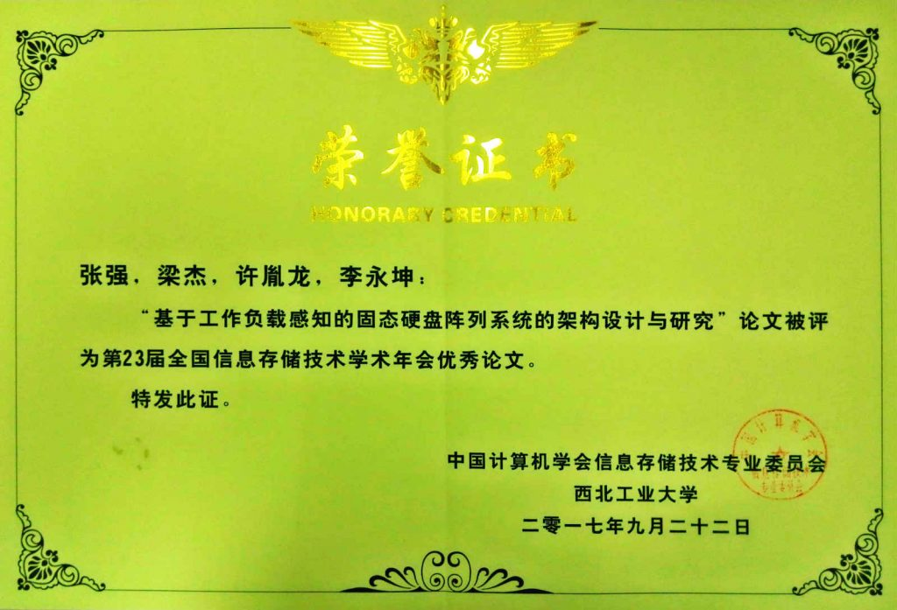

2017年9月20日-22日，第23届全国信息存储技术学术会议在西北工业大学举行，实验室投稿的两篇论文均被录用，分别是研一新生张强撰写的论文《基于工作负载感知的固态硬盘阵列系统的架构设计与研究》和李佳伟撰写的论文《Spark的内存重删优化》。

其中，张强撰写的论文《基于工作负载感知的固态硬盘阵列系统的架构设计与研究》，通过在RAID-0阵列中设计一种基于冷热数据分离存储的固态硬盘阵列系统架构HA-RAID，并结合滑动窗口技术进行优化，很好地实现了阵列系统级的负载和磨损均衡，并有效提升固态硬盘阵列系统的I/O性能。论文得到大会评审专家的高度认可，并受到与会学者的广泛关注，最终荣获会议优秀论文奖。

据悉，此次全国信息存储技术学术会议共收到来自全国各个高校和科研院所的58篇学术论文，经过专家多轮严格评审，35篇论文被会议录用，最终5篇论文获得优秀论文奖。
