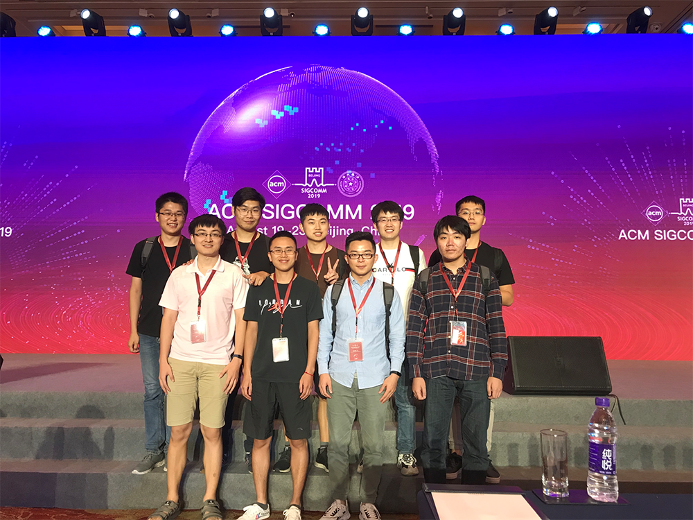
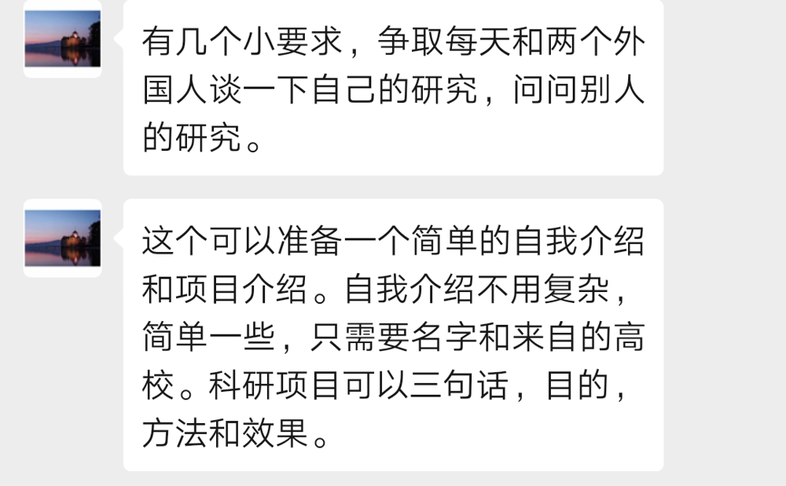
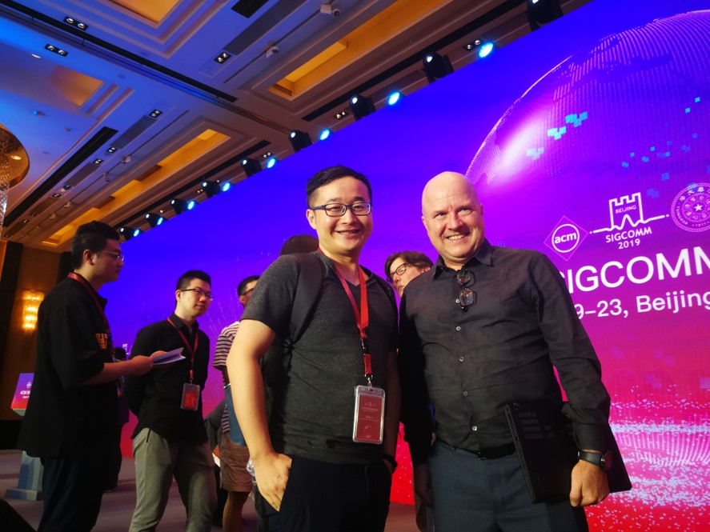
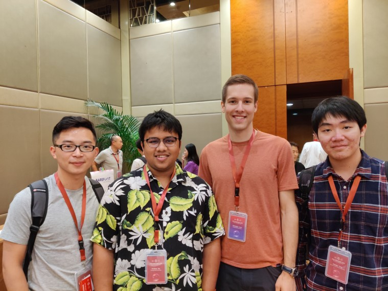
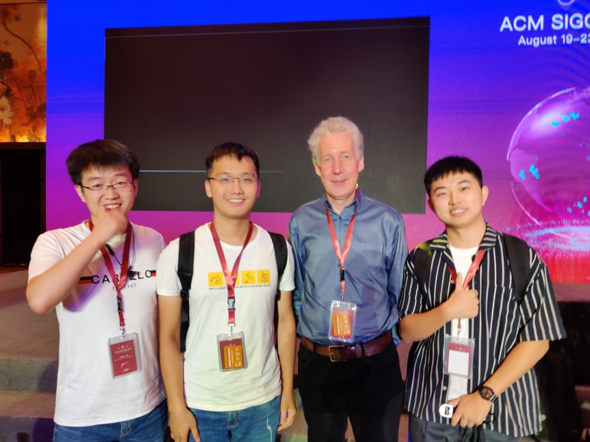
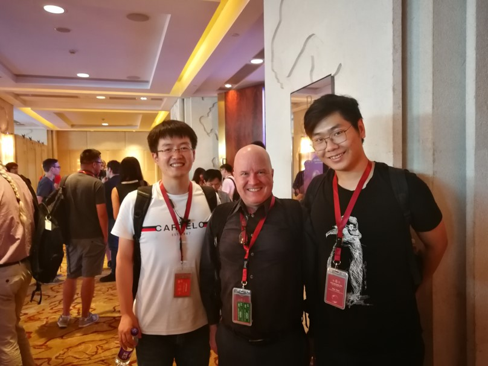
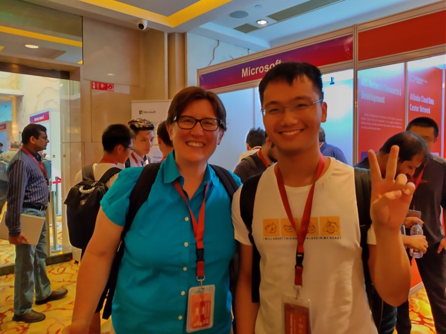
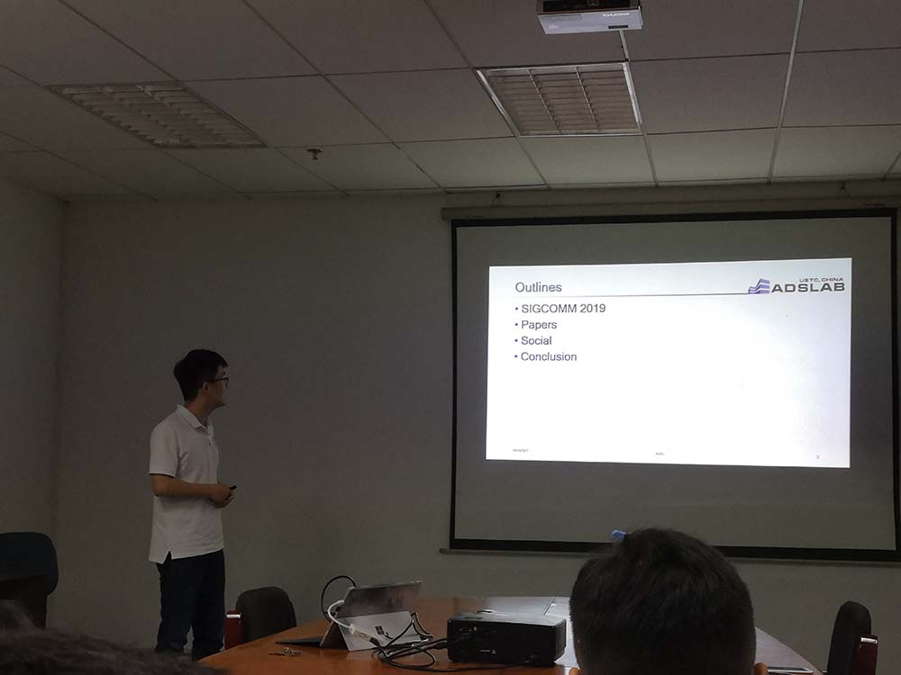
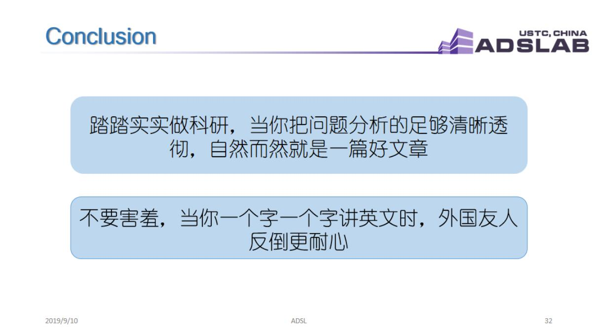

2019年8月20-22日，全球网络通信领域顶级会议ACM SIGCOMM 2019在北京举办，正值互联网诞生五十周年，ADSL实验室李诚老师，吕敏老师与实验室部分本硕博同学一起赴京参加会议。

SIGCOMM是网络通信领域的顶级会议，此次参会同学们除了了解最前沿的研究报告外，也获得了与国内外研究者进行学术交流的好机会，李诚老师也为大家布置了交流任务。

在回到实验室后，实验室白有辉同学代表参会同学们为大家分享了本次参会的经历，并介绍了几篇会上了解到的或是十分扎实，令人信服，或是十分精妙，让人耳目一新的前沿研究。

同学们对实验室和老师们给予的这次参与国际顶级会议的机会十分珍惜与感谢，也受到鼓励继续努力科研，争取做出更好的成果，将ADSL展示到更好的舞台！