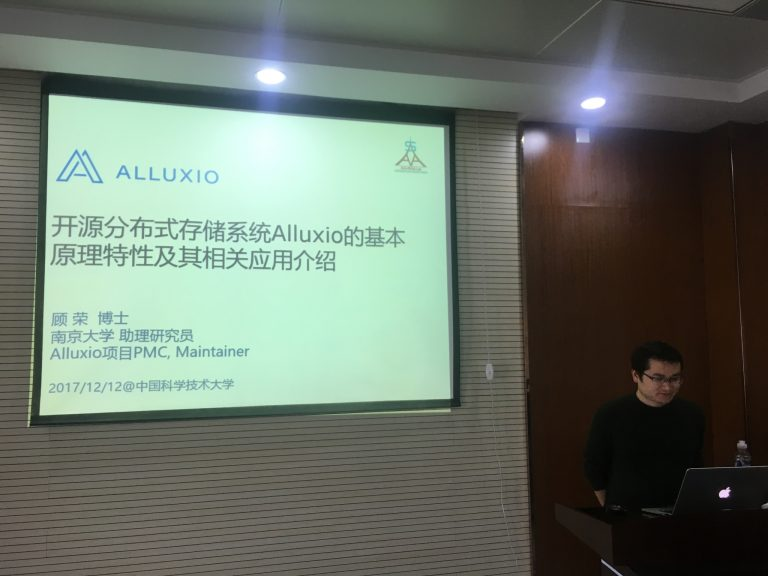

2017年12月12日，实验室有幸邀请到南京大学计算机系顾荣博士来访并作报告，顾荣博士毕业于南京大学计算机系并留校任教，以第一作者身份在分布式并行计算领域的一流期刊和会议上发表论文10余篇，包括TPDS，JPDC，IPDPS等。顾荣博士作为国内知名的大数据开源存储项目Alluxio PMC的成员，领导团队完成了Alluxio很多功能稳定和增强方面的工作，包括性能测试框架Alluxio-Perf、Alluxio缓存策略优化、Alluxio与Hadoop生态系统多个组件的整合等。此外，顾荣博士还设计实现了Spark 1.0版本中发布的支持RDD存储到Alluxio的功能。

报告中，顾荣博士首先介绍了Alluxio的发展历程，Alluxio（原名Tachyon）是世界上第一个以内存为中心的虚拟分布式存储系统。统一了数据访问的方式，为上层计算框架和底层存储系统构建了桥梁。然后，顾荣博士介绍了系统的基本工作原理和特性，应用只需要连接Alluxio即可访问任意底层存储系统中的数据，Alluxio以内存为中心的架构也使得数据的访问速度能比现有常规方案快几个数量级。之后，顾荣博士还介绍了Alluxio的典型应用场景以及业界使用案例。最后，顾荣博士简要介绍了其团队在Alluxio上进行的一些研究与开发工作。实验室老师和同学在报告后还与顾荣博士进行了深度交流，详细了解了Alluxio的工作原理和特性，受益良多。

Alluxio是伯克利大数据分析软件栈（Berkeley Data Analytics Stack）中的存储层软件, 也是 Fedora发行版的一部分。自今年1月份发布1.6版本的过去4年内，已有超过100个组织机构的600多位贡献者参与到Alluxio项目的开发中，包括阿里巴巴, Alluxio, 百度, CMU，IBM，Intel, Red Hat，Yahoo, UC Berkeley和南京大学等。Alluxio出自UC Berkeley的AMP Lab，中科大校友范斌博士很早就加入了该项目，也是该项目的核心成员。范斌博士还是实验室李永坤副教授的同门师兄，都师从香港中文大学的John C. S. Lui教授，希望通过这次报告，能够与Alluxio开展更进一步的合作，促进实验室在存储方面的研究