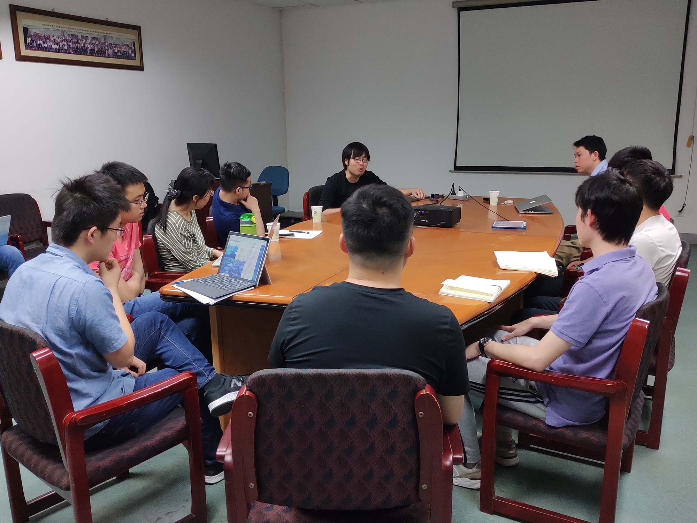
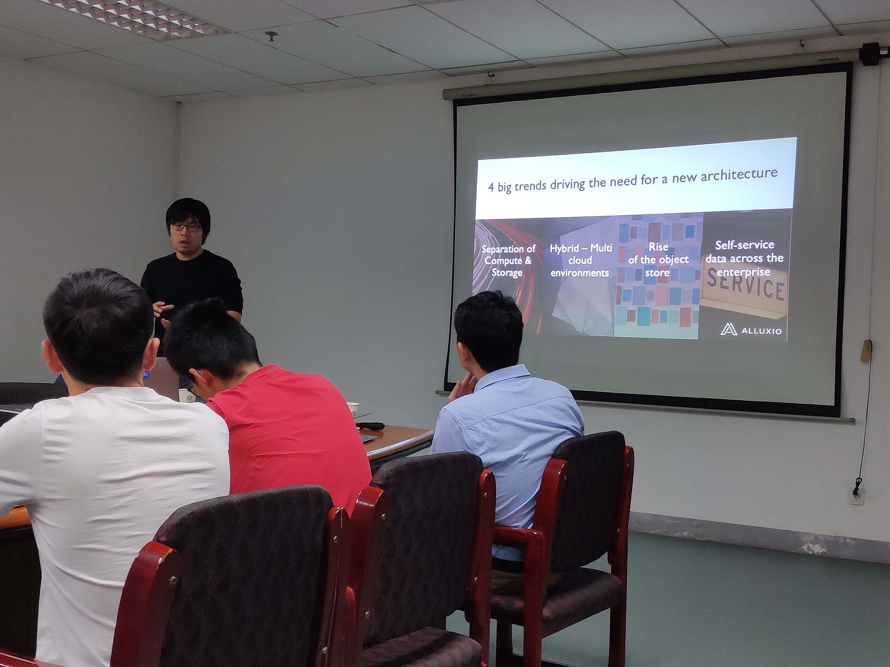

5月21日，开源分布式存储系统Alluxio的创始成员之一，同时也是科大99级的校友：范斌博士来访实验室并带来了一场题为“计算和存储分离架构下大数据栈的演化”的报告。

报告开始前，范斌博士首先以师兄的身份，为大家简要分享了自己在读书期间的科研经历与研究方向。

范斌博士首先为大家介绍了四个正在业界流行的趋势，接着引出了Alluxio系统：计算与存储分离的环境下的中间层。同时，细致地为大家介绍了Alluxio的系统架构。关于Alluxio系统的优势、未来发展方向、可能存在的问题等与实验室同学们进行了交流与讨论。

与业界的交流，能够使得我们更清晰地了解到业界的切实需求，更敏锐地发现隐藏的问题，也能更深刻地思考自己的研究方向，也希望能有越来越多的企业参与到与ADSL的合作、交流中来。