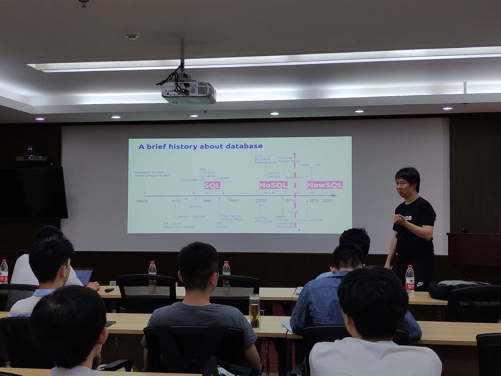
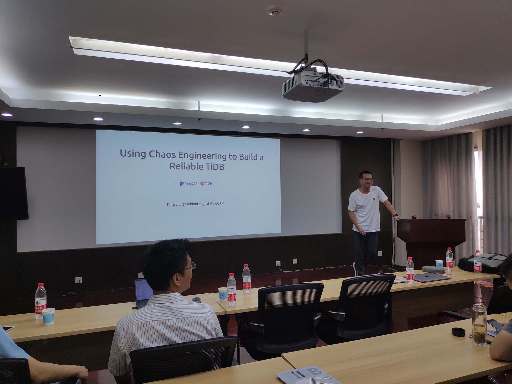
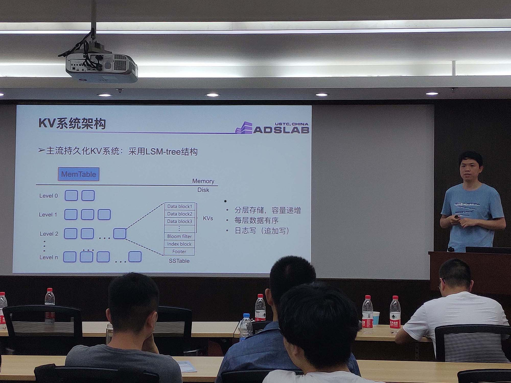
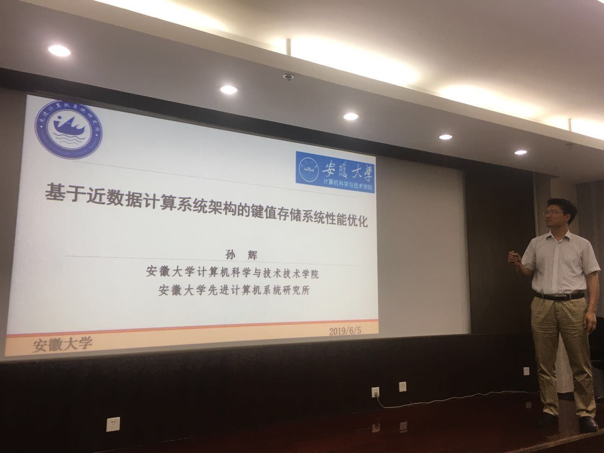

2019年6月5日，ADSL实验室邀请到了PingCAP联合创始人崔秋老师、PingCAP首席架构师唐刘老师、中国科学技术大学计算机学院李永坤副教授、安徽大学计算机学院孙辉助理教授四位老师，开展了一场内容丰富、干货满满的技术交流会。
会上，由PingCAP的联合创始人崔秋老师首先介绍了TiDB的发展与开源历程，为大家讲解了传统database的发展历程及各类database的特点与缺陷，并分享了TiDB在初始发展时的曲折历程和思考。除此外，崔秋老师还为大家详细介绍了TiDB社区的发展情况、自身的使用与合作情况、TiDB为开源社区作出的贡献以及TiDB的线上培训等等，让同学们对TiDB有了清晰的认识。提问环节，崔秋老师与李诚老师就TiDB在当今时代能与各类友商区别开来的核心竞争力，以及关于此的深层次原因和未来发展方向进行了交流。

接下来，PingCAP的首席架构师唐刘老师做了一场题为”Using Chaos Engineering to build a better TiDB”的报告，主要为大家介绍了Chaos Engineering的概念、分布式系统中一些无法控制的问题以及如何在分布式系统中使用Chaos Engineering。

茶歇过后，实验室李永坤做了题为“Key-Value系统中的KV分离策略与Bloom Filter管理机制探索”的报告，为大家介绍了实验室近期在KV存储方面的相关工作。

最后，来自安徽大学计算机学院的孙辉助理教授的“基于近数据计算系统架构的键值存储系统性能优化”的报告，为大家介绍了近数据计算等相关工作。

本次技术交流吸引了实验室众多同学参与，大家对于这样充满干货的技术交流表示了很大的兴趣，在交流中学到了很多新的知识，也拓宽了现有的想法，也希望以后的技术交流能越来越精，越来越好。