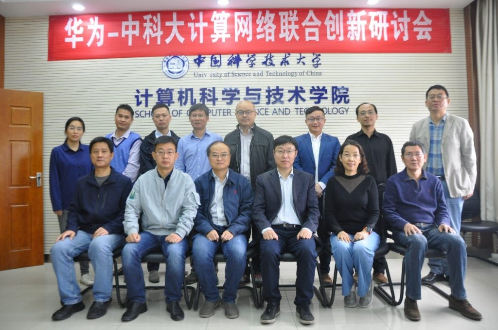
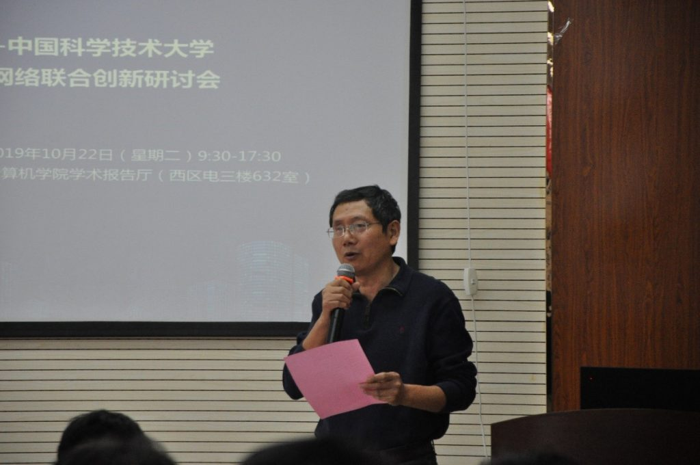
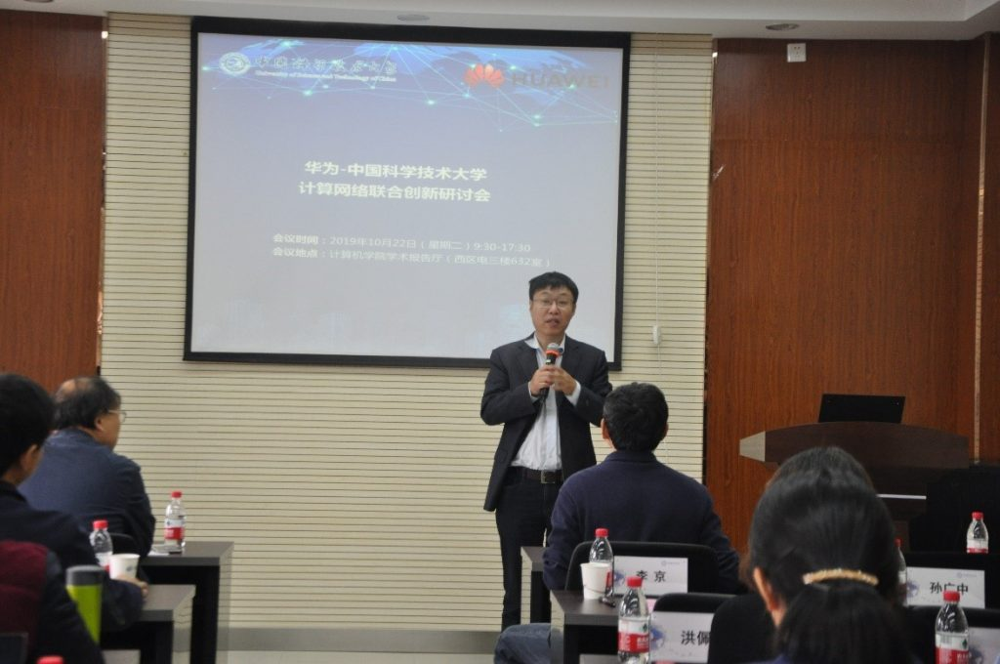
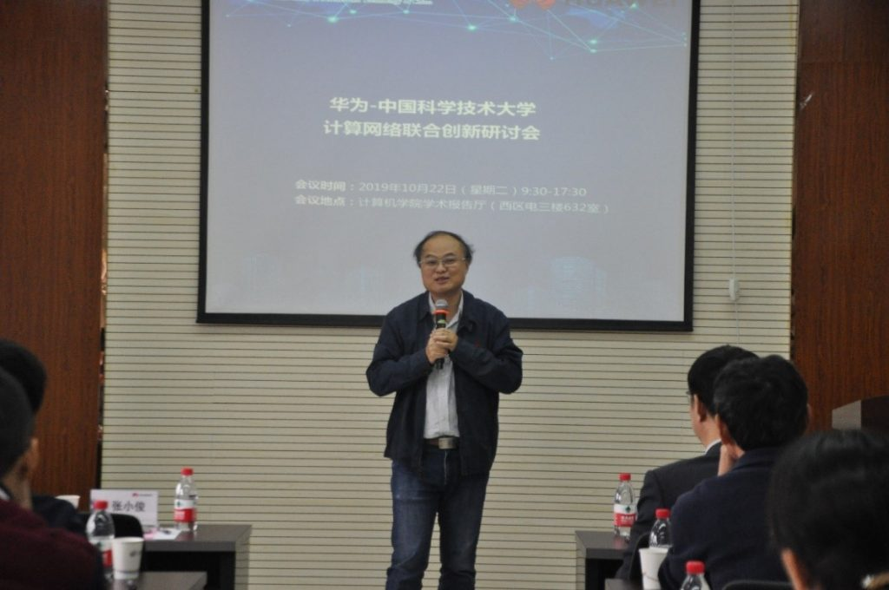
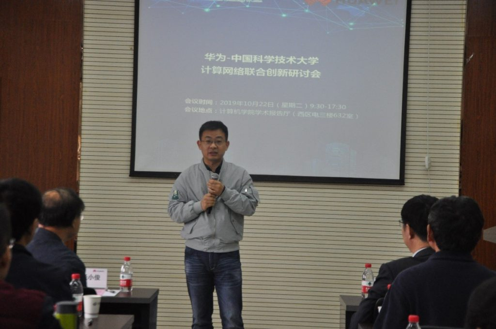
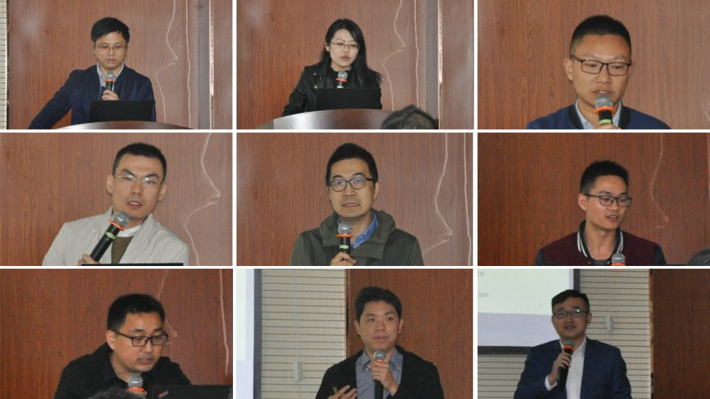
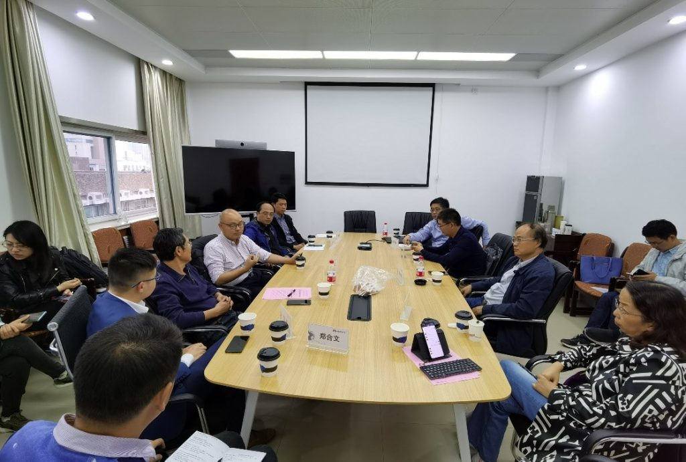

&ensp;&ensp;&ensp;&ensp;2019年10月22日，ADSL实验室联合信息学院信息网络实验室、网络信息中心与华为2012实验室-中央研究院-网络技术实验室在科大西区电三楼共同举办了“华为-中国科学技术大学计算网络联合创新研讨会”。研讨会上，与会人员报告了双方在数据中心网络、存储技术与分布式系统等方面的研究成果，针对计算、存储与网络技术等领域的产、学、研开展长期合作展开了充分的讨论。双方拟合作成立联合创新实验室，致力于在不确定性和多路径中进行探索，实现基础性研究突破和结构性突破，贡献世界级的产出。

&ensp;&ensp;&ensp;&ensp;此次研讨会由许胤龙教授主持，计算机学院副院长陈恩红教授、网络信息中心主任李京教授、信息学院洪佩琳教授、计算机学院副院长孙广中副教授、华为网络技术实验室主任张小俊、华为中央研究院技术合作部部长张建虹、网络技术实验室首席技术专家李宗鹏，网络技术实验室副主任韩磊、计算机学院和信息学院的部分师生、网络技术实验室的多名专家参加了这次联合创新研讨会。

&ensp;&ensp;&ensp;&ensp;此次研讨会由许胤龙教授主持，计算机学院副院长陈恩红教授、网络信息中心主任李京教授、信息学院洪佩琳教授、计算机学院副院长孙广中副教授、华为网络技术实验室主任张小俊、华为中央研究院技术合作部部长张建虹、华为网络技术实验室首席技术专家李宗鹏，华为网络技术实验室副主任韩磊、计算机学院和信息学院的部分师生、华为网络技术实验室的多名专家参加了这次联合创新研讨会。

&ensp;&ensp;&ensp;&ensp;计算机学院副院长陈恩红教授向华为公司的各位专家表示热烈的欢迎，对华为公司取得的举世瞩目的成就表示崇高的敬意。对双方成立联合创新研究中心、开展长期的合作研究表示祝贺，相信在双方的共同努力下，一定会做出优异的科研成果。

&ensp;&ensp;&ensp;&ensp;华为网络技术实验室张小俊主任对中国科大承办了这次研讨会表示衷心的感谢，对中国科大的学术声誉与科大师生踏实肯干的科研精神给予了高度评价。张主任还向与会人员介绍了华为2012实验室-中央研究院-网络技术实验室，祝贺这次研讨会的成功举办，并表达了对联合创新中心的期待。

&ensp;&ensp;&ensp;&ensp;张建虹部长简要介绍了华为中央研究院，并概要介绍了华为与高校的科研合作、人才联合培养与技术联合攻关、华为合肥研究分部等方面的情况。他表示华为在数据中心网络与存储系统方面有长期的科研与技术积累，有国际竞争力的产品，技术力量雄厚。中国科大在网络、存储与分布式系统方面做出了国际前沿的科研成果，双方优势互补，一定能够做出有重要影响力的成果。

&ensp;&ensp;&ensp;&ensp;在研讨会上华为技术专家周洪、孟柯博士、吴涛和孙文昊博士，中国科大许胤龙教授、孙广中副院长、李诚特任研究员、李永坤副教授，两位博士生张红杰、魏文佳就各自的工作做了汇报，与会专家与师生进行了充分的讨论，使得双方能够充分了解，为下一步的深度合作打下了良好的基础。

&ensp;&ensp;&ensp;&ensp;报告结束后，双方对未来可能的合作方向、合作方式等方面展开了充分的讨论。在讨论会上，李京教授简介了中国科大网络信息中心与超算中心的设备运行、科研支撑以及科研成果等。

