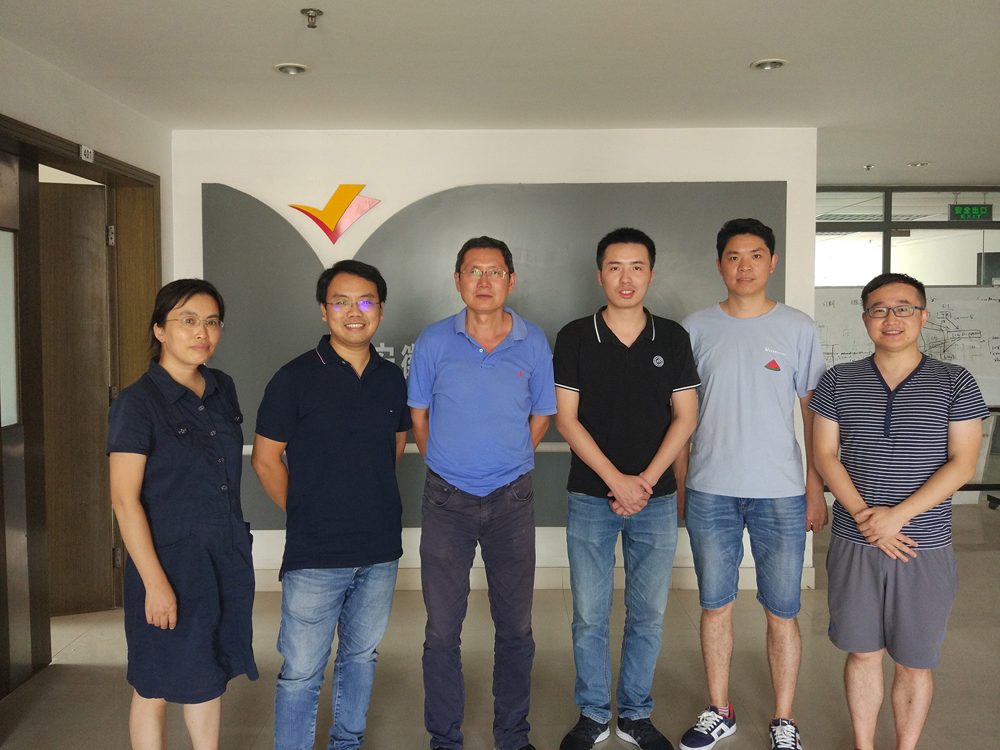
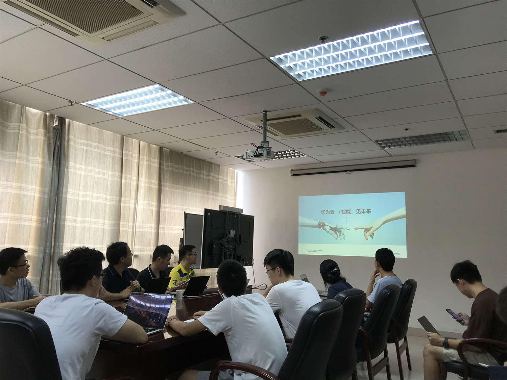
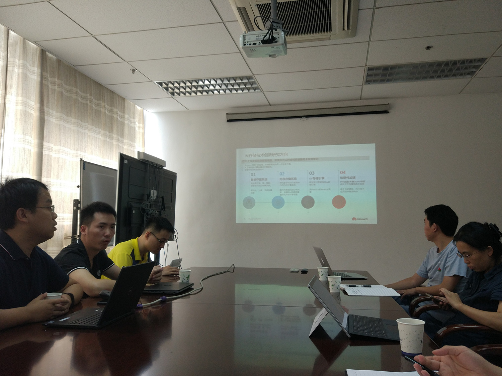

2019年9月12日上午，华为云团队的数名成员来访实验室进行交流并作报告。

华为云团队的研究方向与实验室同学们十分贴近，在进行技术分享的同时，同学们也积极交流提问，结合自身研究方向，与华为云团队的成员在分布式存储、EC编码、新硬件的使用、元数据管理等方面都进行了沟通与探讨，有很大的收获。

报告持续了约两个小时，由于与实验室研究方向十分贴合，大家对报告内容都十分感兴趣，也从中获得了对自身的研究、学习的启发，欢迎更多的技术团队来与实验室进行交流，一起在系统的高峰上不断攀登前行！