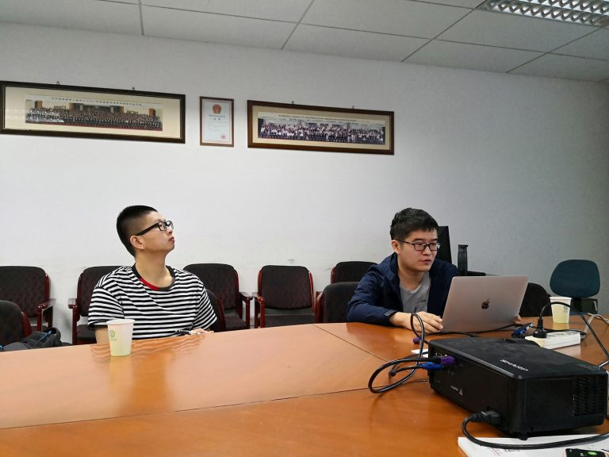

2018年10月12日上午，华为工程师刘宇涛访问我实验室，于国家高性能计算中心（合肥）召开了项目启动会。

首先，实验室负责人许胤龙教授感谢了华为公司对实验室的项目资助，并介绍了实验室的研究课题与研究成果。

随后，实验室博士生郭帆向刘宇涛工程师介绍了《Lightweight and Efficient Memory Deduplication  for Huge-Page Enabled NUMA Machines》项目的进展情况，分别从Reduce Overhead Brought by Deduplication、Guarantee Memory Access Performance in Huge-Page Enabled Systems和Reduce Across-nodes Access In NUMA Systems这三个方面介绍了项目的内容。

最后，实验室师生与刘宇涛工程师进行了沟通，深入探讨了项目中存在的技术问题。并就华为公司目前在实际场景中遇到的新问题进行了有效的讨论，期待与华为公司做更深一步的合作交流。