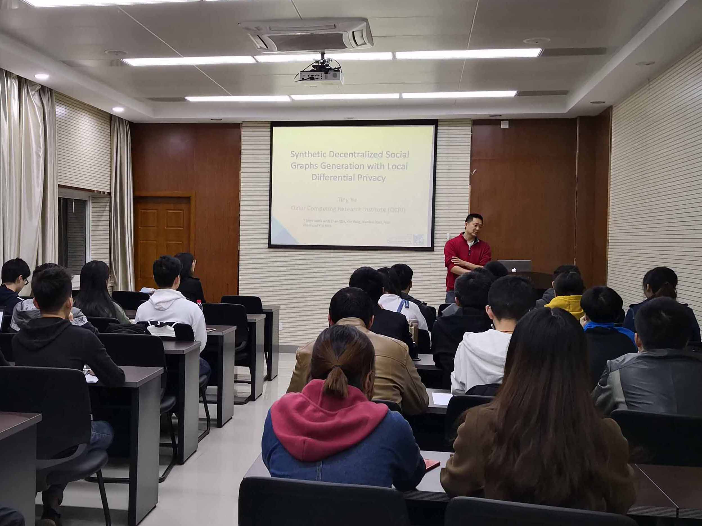
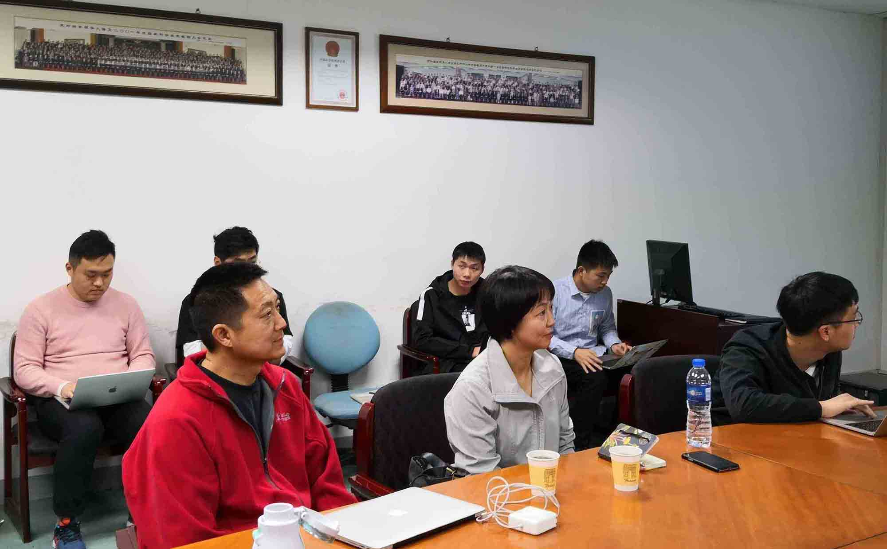

2019年4月2日与3日，卡塔尔计算研究所(QCRI)首席科学家马晓松博士、研究主任于挺博士来访实验室进行学术交流。

关于自己的研究，于挺老师首先为大家带来了一场题为”Synthetic Decentralized Social Graphs Generation with Local Differential Privacy”的报告。

4月2日下午，马老师与于老师旁听了实验室汪睿、阮超逸两位同学关于图算法、新硬件相关的研究；

4月3日上午，两位老师旁听了徐亮亮、李佳玮、陈友旭、苏景波同学在分布式系统、存储与网络等方面的研究。

对于同学们的研究，两位老师都进行了点评并给出了富有帮助性的建议，同学们表示收获颇丰。

于挺老师个人履历：

Ting Yu is the research director of the cyber security group of Qatar Computing Research Institute (QCRI), Hamad Bin Khalifa University. Before joining QCRI in 2013, he was an associate professor in the faculty of Computer Science Department, North Carolina State University. He obtained his BS from Peking University in 1997, MS from ​ ​Minnesota University in 1998, and PhD from the University of Illinois ​ ​ at Urbana-Champaign in 2003, all in computer science. He is a ​ ​ recipient of the NSF CAREER Award in 2007. His research areas focus on privacy preserving data analysis, data anonymization, and security data ​analytics.

马晓松老师个人履历：

Xiaosong Ma is currently a Principal Scientist at Qatar Computing Research Institute. Previously, she was Associate Professor in the Department of Computer Science at North Carolina State University, as well as a Joint Faculty Member at Oak Ridge National Laboratory. Her research interests are in the areas of workload characterization, graph processing, distributed/cloud computing, and high-performance storage systems. Xiaosong has published over 90 research papers (including at top conferences such as OSDI, FAST, EuroSys, USENIX ATC, Supercomputing, and HPCA) and currently serves on the editorial board of the Elsevier Journal of Parallel and Distributed Computing and the ACM Transactions on Storage. She received both the DOE Early Career Principal Investigator Award and the NSF CAREER Award, and was named a University of Illinois Department of Computer Science Alumni Distinguished Educator. Xiaosong received her Ph.D. from the University of Illinois at Urbana-Champaign in 2003, and her B.S. from Peking University in 1997.