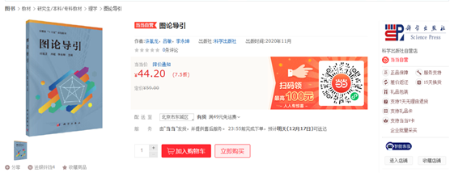

&ensp;&ensp;&ensp;&ensp;实验室许胤龙、吕敏、李永坤三位老师主编的新教材《图论导引》在科学出版社现已在电子商务平台和当当上线。

&ensp;&ensp;&ensp;&ensp;这本书分为基础知识与应用两部分，是几位老师结合三十多年计算机专业本科《图论》课程教学的实践经验编撰而成，不仅参考了国内外多本教材，而且在总结了图计算方面最新的研究成果。为提高学生的学习兴趣，本书从应用实例导入图论知识点，再介绍相关基础知识与基本理论，使学生更易理解。

<!--  -->