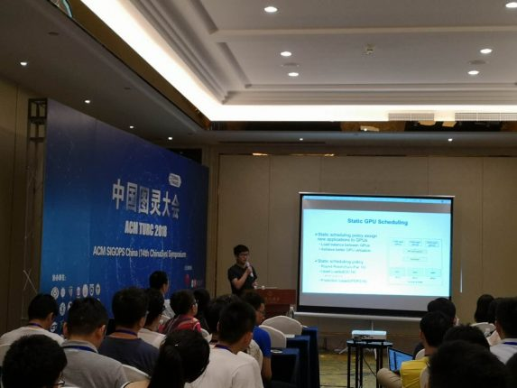
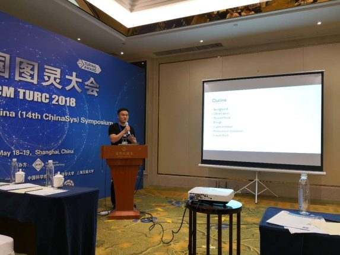
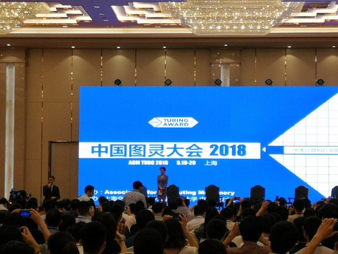

中国图灵大会（ACM TURC 2018）与2018年5月18-20日在中国上海举行，此次ACM图灵学术盛会以“引领人工智能 创造无限可能”为主题，举行了包括几位ACM图灵奖得主在内的特邀报告、主题论坛、专题论坛、演示和展览等多种形式的交流活动。与此同时， ChinaSys系统会议也于此同期举行，我们实验室有李永坤老师和李诚老师，还有郭帆、陈友旭、白有辉、田成锦和汪睿同学，师生共计7人赴沪参会。

此次大会中，我们实验室的博士生郭帆和陈友旭的论文双双被ChinaSys会议录用，并分别于5月18日下午和5月19日下午在ChinaSys分会场做报告。

郭帆同学在ChinaSys分会场做报告。他感到非常荣幸参加了这次计算机领域的学术盛会–第二届中国图灵大会，并在ChinaSys分会场做了报告，经过这次会议，得以一睹诸多学者的风采，也有幸聆听了很多优秀的报告。他不仅学到了许多专业相关的知识与技术，也进一步锻炼了演讲能力，对于当前国际上前沿的研究方向及方法内容有了一定的了解。

陈友旭同学在ChinaSys分会场做报告。他表示：很庆幸自己可以在ChinaSys’2018会议上分享近期在分布式文件系统中做的一些工作，并且有这么好的机会和众多老师和学生交流问题，获得更专业的反馈，从而对自己下一步的工作有了更明确的规划。会议期间也学习了学术界和工业界前沿的问题，听了很多大牛的技术分享，对深度学习处理器、无人驾驶等新型前沿科技有了更深的了解。并且众多老师和学术前辈向我们分享了他们做科研的经历、对各自行业的理解、解决问题的思路，也为自己以后的科研工作增添了新的视角，获益匪浅。

其他同学虽然没有在大会上作报告，但是聆听各种大牛们分享自己的工作和经验，也都觉得收益匪浅，他们回来后也都发表了自己的感想。

**白有辉**：目前我的科研领域是分布式机器学习系统，旨在上层支持机器学习的众多算法应用，下层合理调动硬件资源，实现资源合理的利用，因此参与此次会议，希望能够丰富自己的相关知识，以此启发自己。在大会上我了解到，一份好的系统领域的工作，是需要长期的积累，需要耐心的调试，还要多思考，有自己独到的见解。好好努力，下一次站在台上讲报告的就是自己！

**田成锦**：我很高兴能够参加这次会议，会议的主题围绕着AI进行，许多学术界和工业界的大牛们分享他们对该领域的看法，向我们展示了他们的一些最新成果。在SIGOPS和SIGMOD专题研讨会上还有许多存储领域的相关工作，听完后让我感到收获颇丰，意识到该领域还有许多值得我们去认真研究的地方，自己的知识面还很匮乏，还需要多花时间了解该领域的知识。

**汪睿**：有幸在实验室老师的带领下参加这次计算机界的盛会，会议举办地就在我本科学习四年之久的上海松江，甚是开心！本次会议主会场的前沿讲座，让我了解了更多业界、学术界有关人工智能的最新成果，而在分会场如SIGMOD、SIGOPS的讲座，更是让我了解了更多有关系统领域的知识以及前景，对我目前的工作有所支持，也对我科研的信心有所鼓舞。总而言之，三天的旅程不虚此行，希望以后还有机会参与类似的会议，希望能有更多的机会聆听大牛们的创新工作。

此次实验室一行人参与2018ACM图灵大会和ChinaSys系统会议，老师和同学们都有不同程度的收获，在大会上听到的一些新的思路和方法以及工业界的一些需求，对我们实验室的工作都有一定的启发。