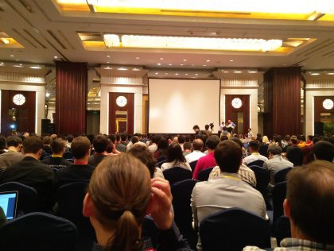
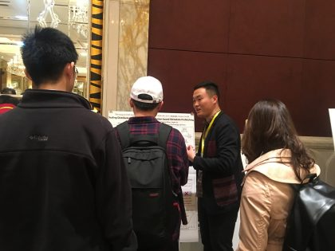
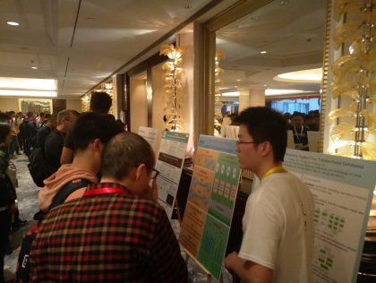
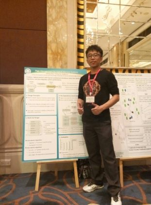

2017年10月28日至31日，第26届ACM操作系统原理座谈会（Symposium on Operating Systems Principles, SOSP )在中国上海召开，这是计算机系统领域的顶级会议。本次会议，我们实验室有李永坤老师和李诚老师，还有陈友旭、白有辉、陈吉强、汪睿和苏景波同学，师生共计7人赴沪参会。

本次SOSP大会，我们实验室的人员在大会上不仅聆听专业领域的大牛们给我们带来的精彩报告，学习领域内最新的技术方法。更是作为大会的服务人员，为SOSP会议的顺利召开尽自己的一份力量。其中，李诚老师作为Poster Session的co-chair，参与组织Poster展区的顺利进行；陈友旭，白有辉，陈吉强和汪睿四位同学也申请到大会赞助商方面提供的学生奖学金，不仅拿到免注册费参会的资格，更是拿到了全程来回交通及食宿的资助，他们也作为大会的志愿者，辅助大会的顺利进行。

**第二部分 成果展示**

我们实验室这次来到SOSP大会，不仅仅是作为聆听者和服务者，更是带来了一些我们自己的成果前来展示和交流学习。其中我们有一位同学入围学生竞赛单元（Student Research Competition，SRC），另外两名同学入选Poster展示。

陈友旭同学成功入围学生竞赛单元（Student Research Competition，SRC），并在Poster展区展示他当前的工作。他表示，这次入选SOSP会议学生竞赛单元是对目前工作的一种肯定，通过和许多学术大牛交流，获取许多宝贵意见，对以后工作的开展有很大的促进作用。近距离的感受这些系统领域的顶级工作，聆听报告人的精彩演讲，学着如何探索新问题、解决难点、实现并最终呈现一个好工作， 这些在科研工作中十分重要。 会议期间也认识了很多新朋友，通过把自己的工作分享给别人从而得到更多的宝贵意见对目前的研究帮助很大，也从他们身上学到很多行业领域内的热点问题，对以后的工作帮助很大。

白有辉同学成功入选Poster展示，在展区与国内外学者共同研究探讨学术问题。他认真地给感兴趣的研究者讲解自己的工作，从背景知识到发现的问题，再到该问题给系统带来的影响，最后采用什么样的技术方案去解决。有学者赞许他的新思路，表示这个方向是正确的，并且想要一起合作，结合他们的研究工作，使得该工作更好更有价值，另有工业界大牛表示让他去知名企业实习，来拓展这份工作。他觉得，赞许是对他工作的认可，宝贵的意见又给他提供了更多可以挖掘的技术点，对他的研究至关重要，在将来的学习科研中，将会走的更稳更踏实。

陈吉强同学也成功入选Poster展示，在展区展示他当前工作的成果，更有知名企业负责人听了他的工作报告，直接邀请他去改企业实习，一起合作继续完成当前工作的研究。他表示，这次参加SOSP会议果然不虚此行，不仅有幸沉醉于世界名校精英的奇思妙想，也深深被一篇篇顶级的科研工作所触动。再次感谢老师们的细心指导，以及业界大牛的肯定鼓励。在接下来的工作学习中，继续进步。

此次实验室一行人参与存储界顶会SOSP会议，都感到收获颇丰。无论是聆听学术界大牛们的研究报告，欣赏他们的卓越风采，还是和工业界大卡探讨交流，悉听他们的宝贵意见，都让我们拓展了知识面，开拓了新思路，并且强烈意识到自己对该领域知识的匮乏和不足，需要进步的地方有太多太多。只有潜心好学，多思多问，才能在存储领域争得一席之地。参与本次会议，也是我们实验室冲击存储领域顶会迈出的第一步！