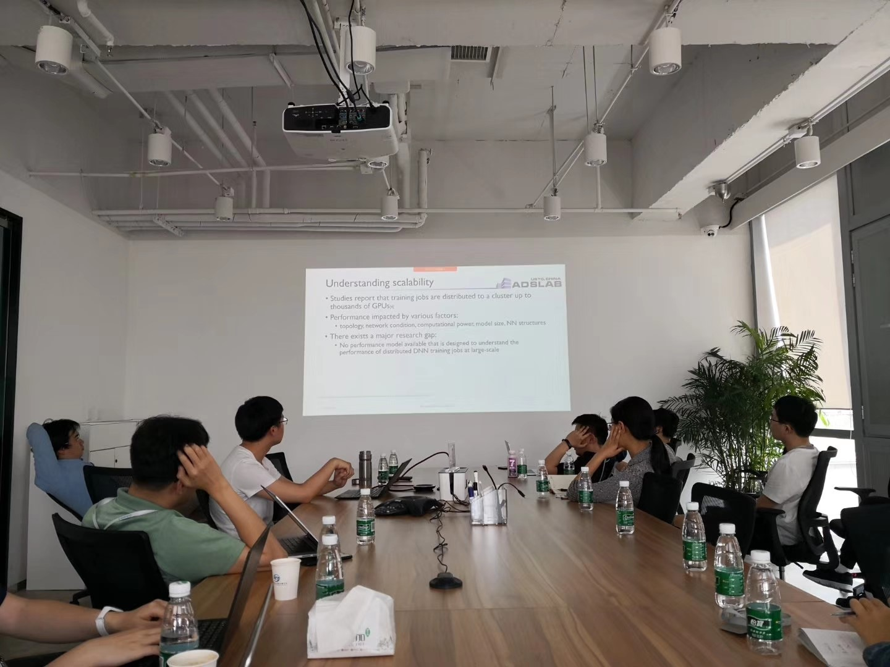
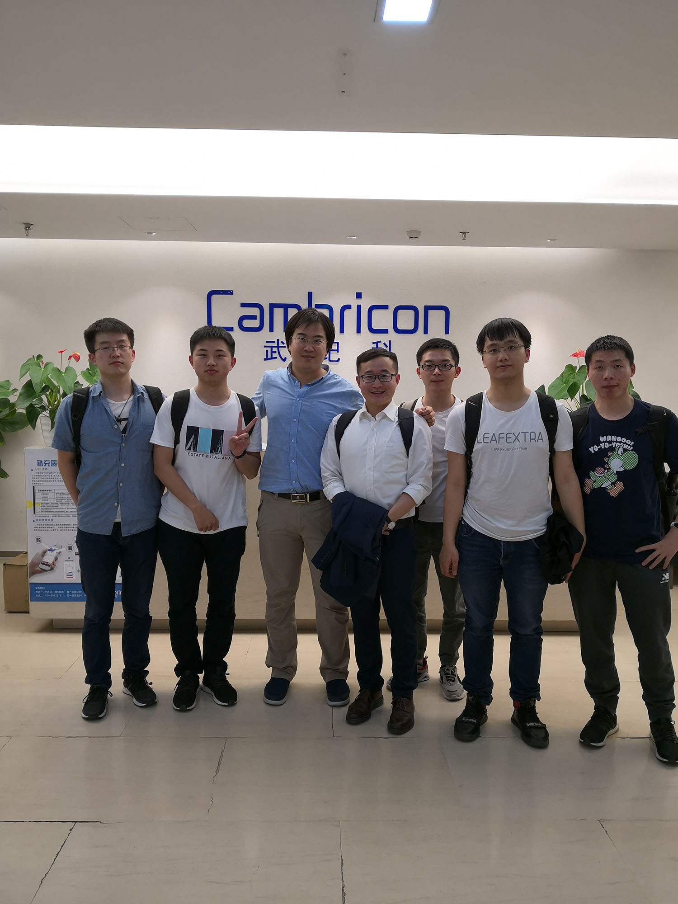
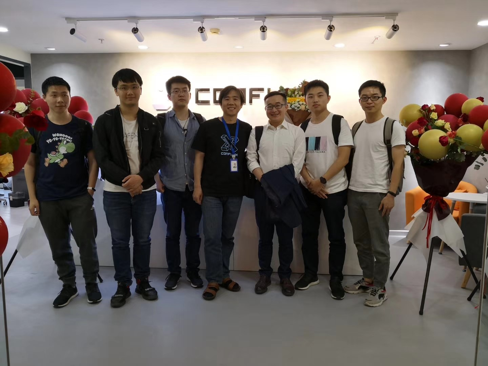

2019年5月9日至10日，李诚老师和实验室白有辉、许冠斌、金泽文、阮超逸、李嘉豪同学等一行6人应邀参访字节跳动、寒武纪和Conflux三家公司，开展学术交流活动，并洽谈合作研究。

5月9日上午，李诚老师带领一行人来到字节跳动公司，受到了AI Labs的负责人郭传雄博士的热情欢迎。郭传雄老师在计算机网络和系统领域深有影响，曾在SIGCOMM, NSDI等网络系统领域顶级会议上发表多篇论文，现任AL Labs主管一职。上午9：30-11：00，白有辉、阮超逸同学和李诚老师分别就实验室在“分布式深度学习训练加速”工作上的进展，向AI Labs的研究人员进行了详细汇报，并与他们进行了深入的探讨。郭传雄老师及部分AI Labs的研究人员向我们提出了非常中肯而又实际的建议，指明了目前工业界的具体需求，给我们提供了新的思考问题的方向。

5月9日下午一点半，我们来到了由科大校友陈天石和陈云霁创立的，AI芯片独角兽公司——寒武纪。寒武纪是全球智能芯片领域的先行者，公司的使命是打造各类智能云服务器、智能终端以及智能机器人的核心处理器芯片，让机器更好地理解和服务人类。在寒武纪公司，我们受到了负责人刘少礼博士及其他研发人员的热情接待。首先，由白有辉，阮超逸汇报实验室在“分布式深度学习框架”和“分布式深度学习训练性能模型”等方面上的研究成果。该研究成果引起了寒武纪公司研发人员的极大兴趣，他们从芯片开发的角度向我们提出了实际需求，期待未来合作一起攻克这些有影响力的挑战。学术交流后，在刘少礼博士的带领下，我们参观了寒武纪公司，并了解了寒武纪新一代的芯片实物。

5月9日下午三点半，离开寒武纪后我们又马不停蹄地来到了Conflux公司。 Conflux公司是一家成立不久的创业公司。该公司的核心技术Conflux是一个高速、可扩展并且完全去中心化的区块链系统，其目的是在不影响安全性的情况下提高交易的吞吐量。在Conflux公司，我们受到了科大校友、Conflux CTO 伍鸣老师的热情接待。伍鸣老师曾在系统顶级会议（OSDI，SOSP，NSDI，ATC，EuroSys等）上发表多篇高质量论文，曾担任SOSP’17的Publication Chair，其在计算机系统领域有着很大的影响力。在Conflux，李诚老师和金泽文同学汇报实验室在“分布式一致性”和“Serverless Computing”方向上的科研进展和思路，伍鸣老师也分享了一些最近的思考。双方还就暑期实习等事宜进行了沟通。

这次的赴京交流，我们收获颇丰。通过和三家公司的交流，我们进一步拓宽了学术视野，发现了一些科研中没有发现的实际工业界需要考虑的问题，这能使我们的工作更完善，并且更符合需求，也就更有意义。同时，我们加深了对双方工作的理解，提高了进一步合作的可能性。

