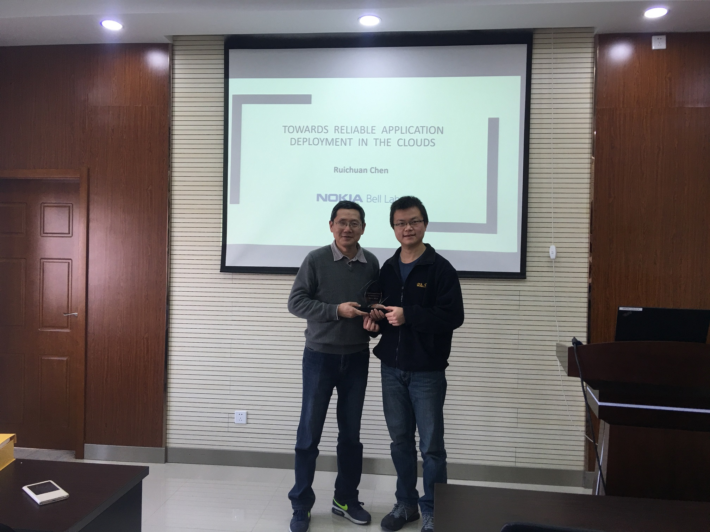
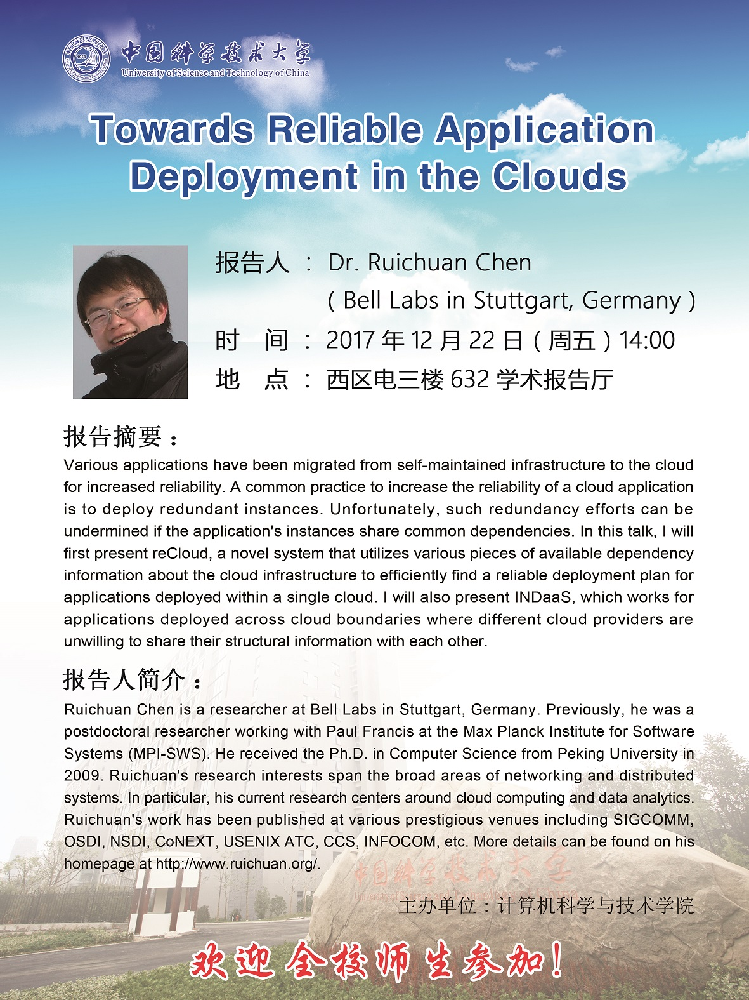

2017年12月20-23日，德国斯图加特贝尔实验室研究员陈瑞川博士到访我实验室，并于12.22下午为大家带来了一场精彩纷呈的题目为“Towards Reliable Application Deployment in the Clouds”的全英文学术讲座。讲座开始前，实验室负责人、计算机学院副院长许胤龙教授热情洋溢地介绍瑞川研究员的学术背景和工作经历，并向瑞川研究员赠送礼物表示感谢。

讲座中，瑞川研究员从互联网服务的实际出发，指出提供可靠的连续在线的互联网服务是互联网公司所面临的重大技术挑战。他说，随着云计算基础设施的出现和繁荣，越来越多的公司依托于该技术实现降低IT成本，提高服务效率的目的。但是，云计算服务并非如同人们所认为的那样可靠，能够提供3个9可用性的服务并不多，因此，需要从互联网云部署的层面去解决可靠性问题。接下来，他重点介绍了如何利用冗余部署、服务器地域选择等策略来降低若干相关子系统同时出现错误的概率和增强所部署服务的健壮性。瑞川研究员和他的合作者围绕这一问题提出了一系列解决方案，并形成了多篇包括OSDI和CoNext在内的高水平学术论文，得到了学术界和工业界的广泛认可。

讲座结束后，我实验室师生与陈瑞川研究员就学术讲座所涵盖的及其延伸的学术问题进行了深入探讨，大家情绪十分高涨，气氛十分热烈。会后，瑞川研究员称赞实验室的学生勤于思考，敢于提问，有很不错的学术研究基础。他还表示，尽管讲座是全英文，但是同学们对技术点的理解很到位，说明大家的英文水平很扎实。同学们也纷纷表示，瑞川研究员的讲座深入浅出，如同抽丝剥茧般干净利落，娓娓道来中使人信服。同学们不仅仅学习到了知识，还学习到了作学术讲座的经验。

另外，在到访期间，瑞川研究员还和实验室师生展开了各种层次的学术交流，特别是分布式机器学习系统方向的研究。他还拜访了计算机学院执行院长李向阳教授和副院长、我实验室负责人许胤龙教授。李院长和许院长详细地介绍了我校及我院海外高层次人才引进的相关政策，鼓励陈瑞川研究员加入到一起建设世界一流学科的行列中来。瑞川研究员表示，十分感谢计算机学院及先进数据系统实验室的邀请和热情接待，他会与学院及实验室继续保持已有联系，加强已有的合作，期待再次来科大短期或长期工作。

 

陈瑞川研究员简历：

 

Ruichuan Chen is a researcher at Bell Labs in Stuttgart, Germany. Previously, he was a postdoctoral researcher working with Paul Francis at the Max Planck Institute for Software Systems (MPI-SWS). He received the Ph.D. in Computer Science from Peking University in 2009. Ruichuan’s research interests span the broad areas of networking and distributed systems. In particular, his current research centers around cloud computing and data analytics. Ruichuan’s work has been published at various prestigious venues including SIGCOMM, OSDI, NSDI, CoNEXT, USENIX ATC, CCS, INFOCOM, etc. More details can be found on his homepage at http://www.ruichuan.org/.

