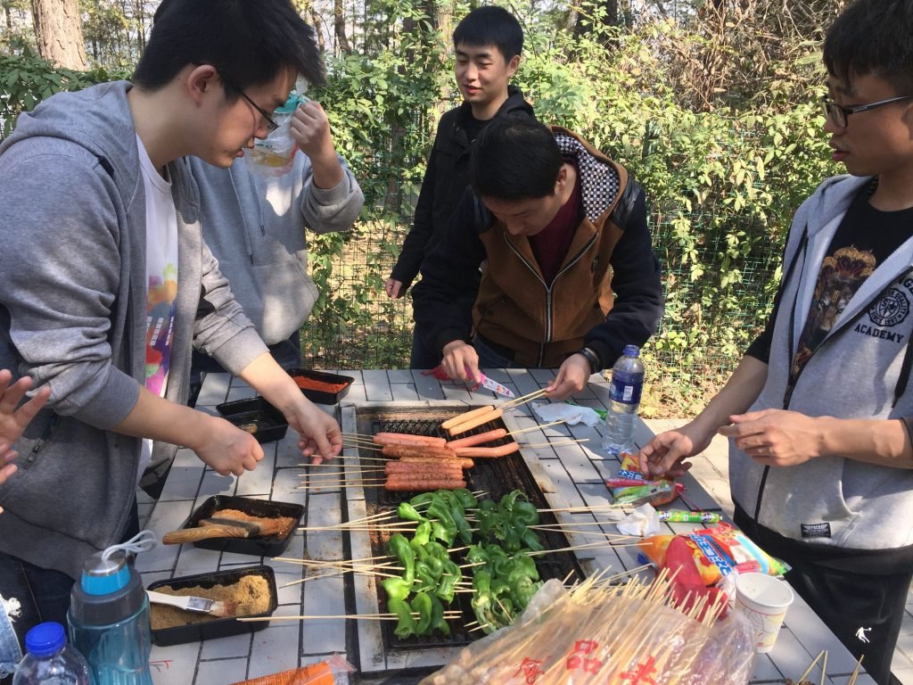
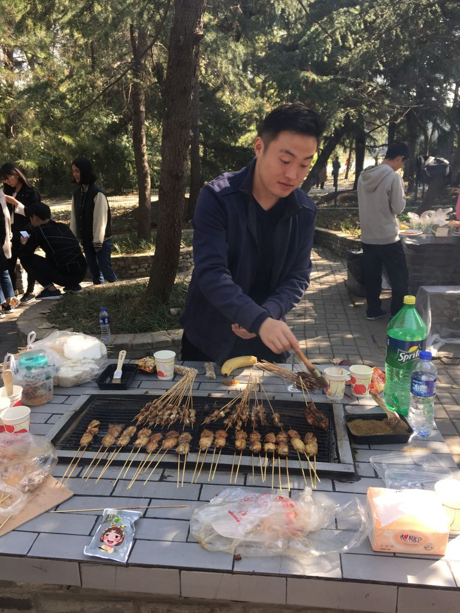
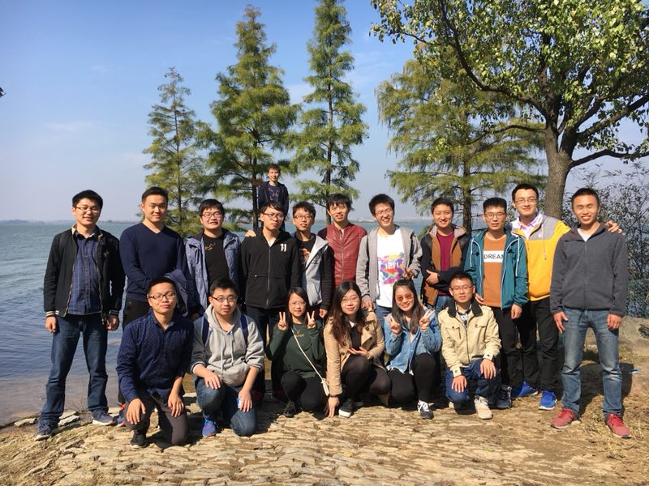
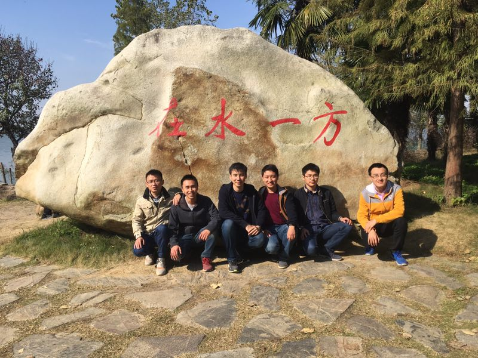

金叶铺地，正值深秋。渐冷的秋风虽然萧瑟，却不能带走实验室各位成员的热情。11月5日，实验室内自发地组织了一场说走就走的植物园之旅。

在得到许胤龙、李永坤、李诚、吕敏等老师的许可和支持下，实验室组织了一次别开生面的植物园之旅。踏着金秋的阳光，各位同学三五成群、谈笑风生，踏上了去植物园的路。

在上午2个小时的烧烤之后，同学们在植物园内进行了游玩。期间，自发成立的“杀人”小分队还玩起了“狼人杀”游戏。

下午4点后，同学们陆续返回。虽然意犹未尽，但是大伙都玩的很满足。