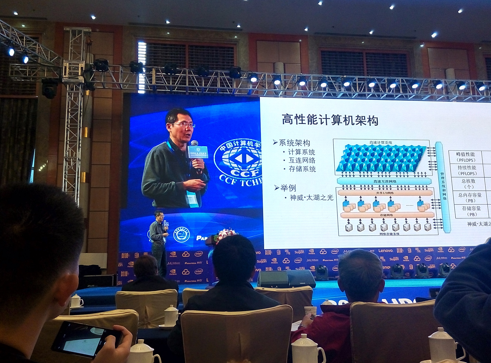
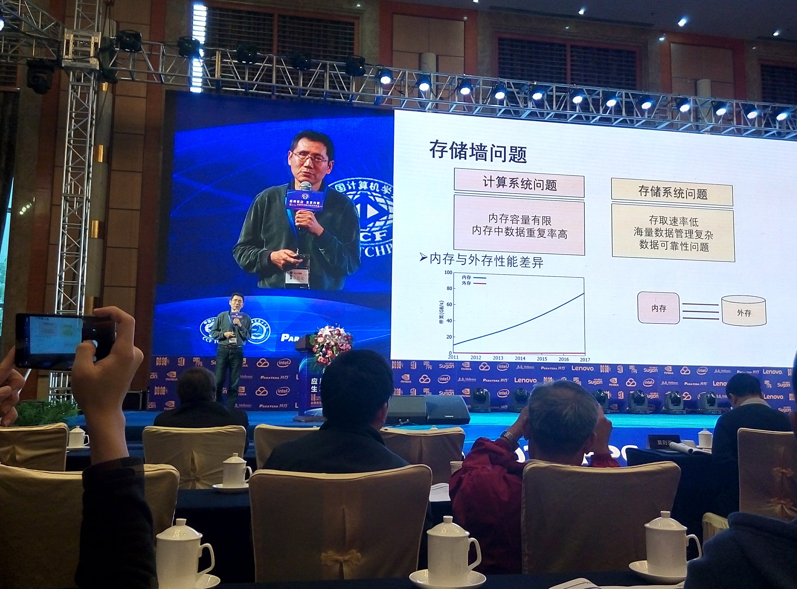
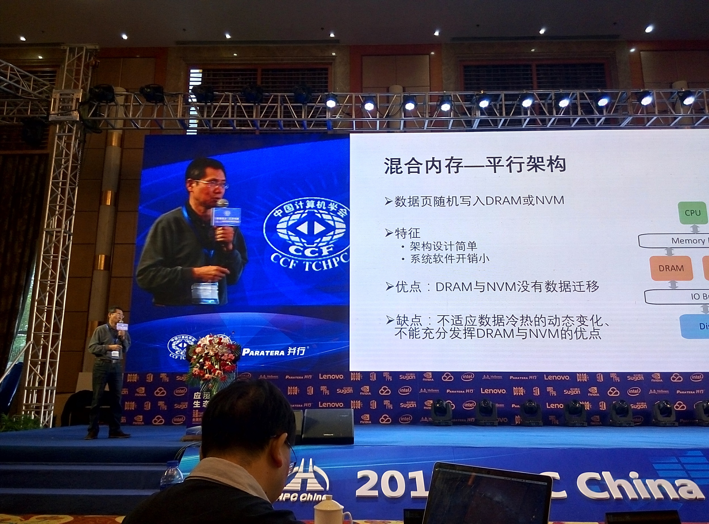
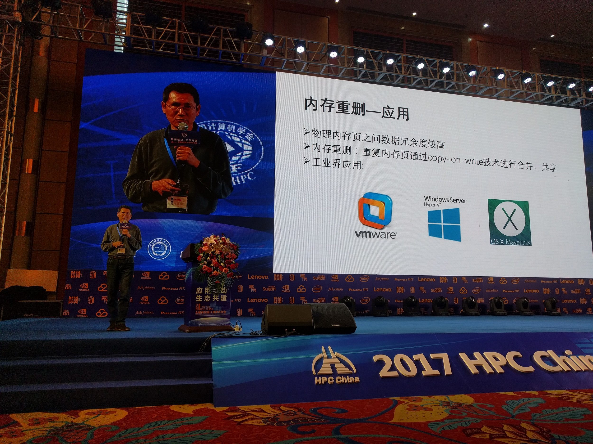
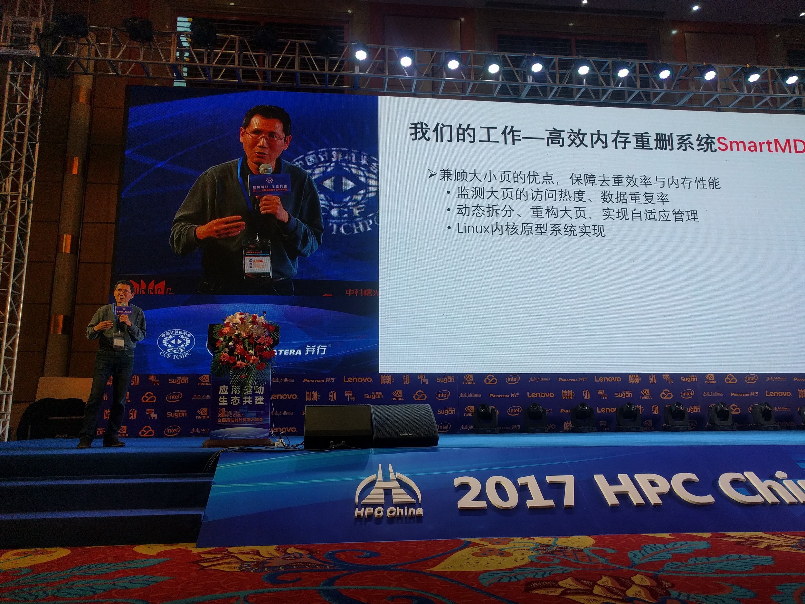

2017年10月19日至21日，2017年全国高性能计算学术年会在安徽合肥成功举行。10月20日上午10点整，作为大会特邀讲席的许胤龙教授在大会主会场做了精彩的报告，报告题目是《高性能计算的存储墙》。

存储墙是高性能系统面临的问题之一。随着处理器主频的不断提升与众核处理器核数的不断增加，高性能计算机的集成运算速度飞速增长。同时，随着存储介质的不断发展以及大数据应用的强烈驱动，存储系统的容量也在成倍增长。但是存储系统的数据存取速度提升却相对较慢，存储墙已经成为影响高性能计算机系统的重要因素之一。许胤龙老师主要分析了存储系统的性能对高性能计算机系统与高性能计算机应用的影响，并从计算机体系结构、存储器介质以及访存管理等方面介绍当前主流的数据存取的加速技术；此外还详细介绍了实验室近期的工作之一：虚拟机混合页内存的管理——《高效内存重删系统SmartMD》（以下简称“SmartMD”，“SmartMD”相关工作的文章已被2017年ATC会议录用。）

许胤龙老师的精彩报告赢得了全体大会特邀嘉宾和参会人员的一致好评，同时实验室的工作也得到了业界同仁的普遍肯定。

