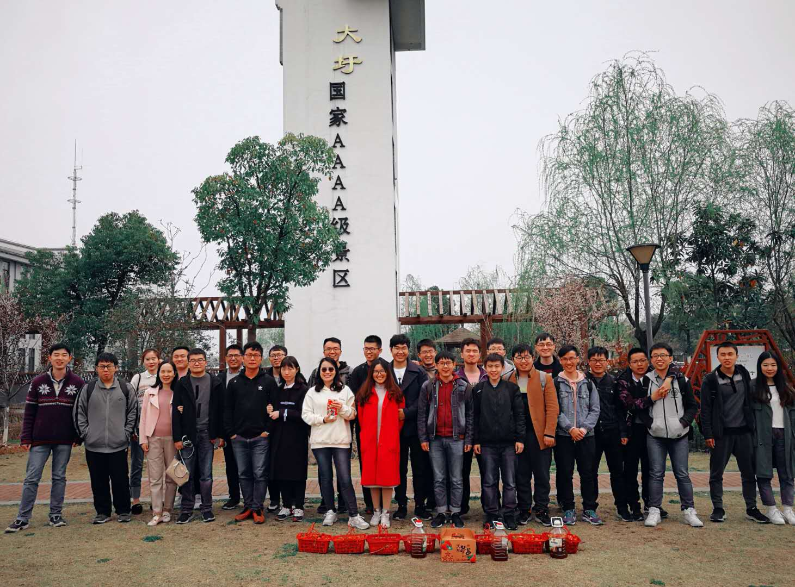

恰逢桃红柳绿，更不可生张熟李。为了不负这大好的时节，也为了增进实验室新老成员间的感情，ADSL开启了19年的春游之行。

游春单单用眼观赏自然是少了几分滋味，而春游的第一站便是深入到春天中去，一起采摘草莓，感受春天真正的风味~

ADSL的同学们深入到郊外的草莓园中，从藤蔓上采摘下红彤彤的草莓，正午时分洗过草莓，大家又一起在大圩聚餐交流，谈论着这一上午的收获。

午后阳光正暖，正应是游园的时刻。大家又各自组成了几个小队，来到杏花公园，或是一起打UNO，或是相互游戏，欢声笑语不绝于耳。

 

日沉天际，是春游结束的时候了，经历了一天的游览与玩耍，同学们定能带着春日的朝气与阳光，回到充实而又丰富的科研生活当中去。

