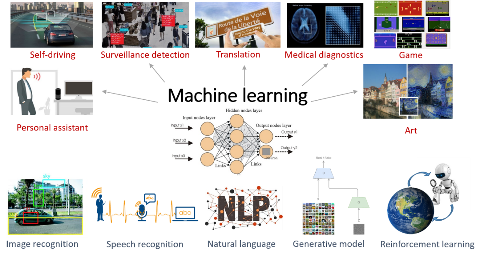
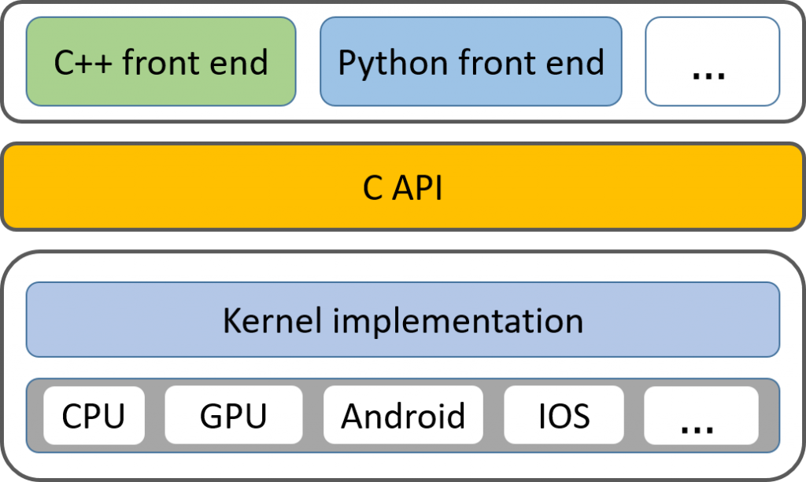

# 分布式机器学习

## 背景
机器学习在近些年带来的突破无须赘言，已经在许多技术领域被证明是非常有效，比如图像和语音识别，自然语言处理，强化学习等，有些已经达到甚至超越人类的水平。这进而使得它在近些年中，已经部分成功的或者是很有希望成功的被应用在许多我们生活的实际场景中，比如自动驾驶，安防，翻译，医疗等等。  
机器学习是从大量的数据中，学习出一个模型，该模型刻画了很多事件的特征，用来对未来发生的事件做出判断。很多机器学习模型，包括绝大部分的神经网络（Neural Networks）、图模型（Graphical Models）、矩阵分解（MF）等等，它们的训练算法都可以被抽象成一个迭代收敛（iterative-convergent）的过程，这个过程将占用大量的计算资源去完成。有研究表明，一个主频为2.0GHz的CPU使用vgg16模型在ImageNet数据集上进行训练，将需要好几年的时间，这跟模型应用的实时性完全不符！由于单机计算能力的受限、训练数据本身非集中等原因，机器学习正在向分布式场景下发展。

## 目标
分布式机器学习系统，即搭建在多设备、多节点的分布式集群上，底层支持多种设备，如CPU、GPU、TPU等，并提供自适应的任务调度能力，以合理地利用计算资源。上层提供接口，提供不同编程语言的实现，以编写不同种类的机器学习算法。如何在多机多设备间合理地调度，以更快的速度计算完成机器学习算法，是分布式机器学习系统设计的主要目标。目前流行的分布式机器学习系统有TensorFlow、MxNet、PyTorch等。  

## 研究方向
基于参数服务器（parameter server）架构的训练流程优化  
参数服务器架构（parameter server）架构被广泛应用在大部分流行的分布式机器学习框架中，如TensorFlow、MxNet等。参数服务器主要由server group和worker group组成，worker group负责模型的计算，server保存整个模型的参数，worker将计算之后的结果的变化和server进行同步，并从server端获取到最新的模型参数，然后进行下一轮迭代计算。

我们发现，使用该架构进行训练，分布式训练竟然比单机训练还要慢，尽管计算力提升不止一倍。这个现象引发了我们的思考，目前主流的分布式机器学习框架都是从单机版本衍生而来，对分布式调度缺少深刻的认识，以至于这些模型并不能完全发挥计算力的提升所带来的效益。主要针对以上这点，我们展开研究。

目前正在阅读MxNet源码和TensorFlow源码，发现了一些非常有趣的现象，并在其中做一些break down的实验，探究影响分布式训练速度的本质因素。