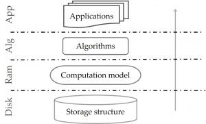
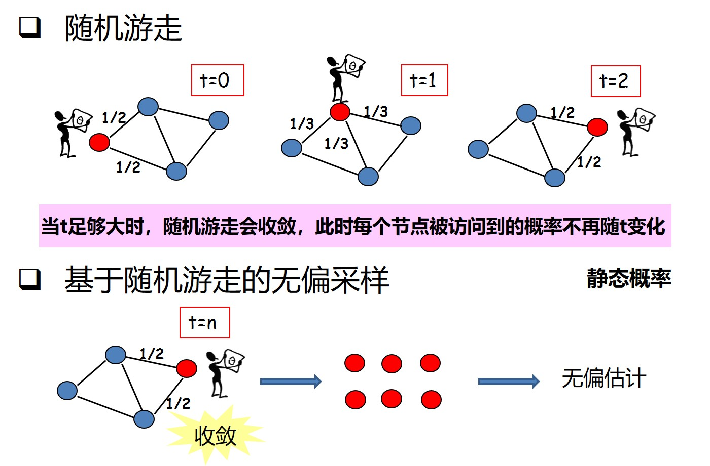
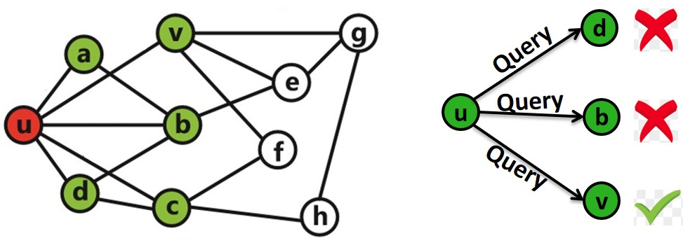
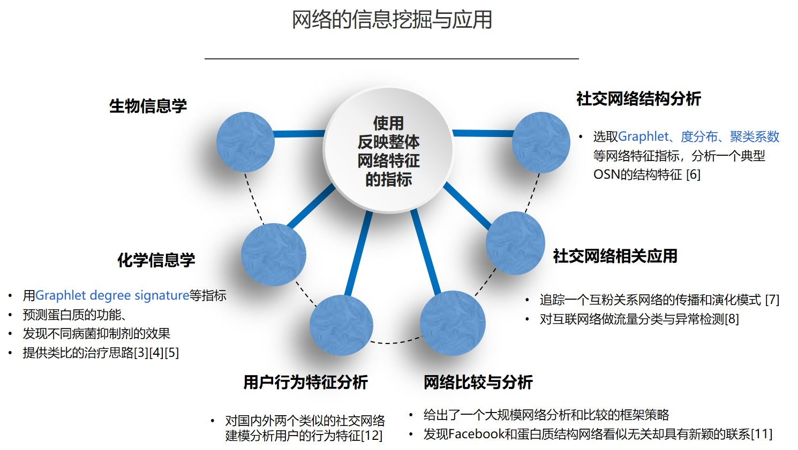
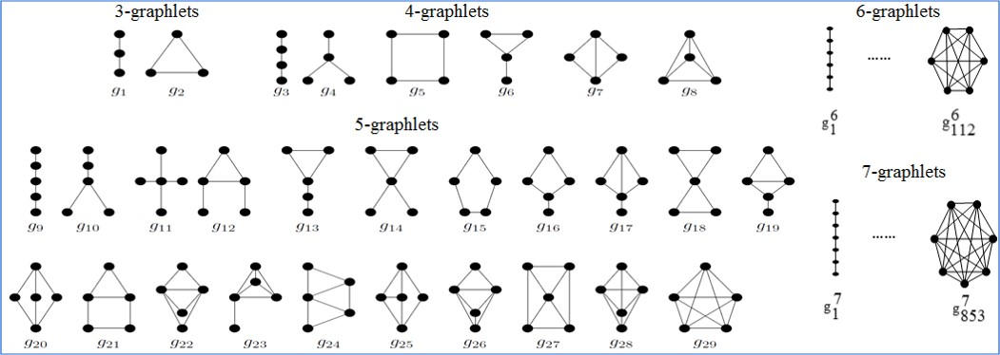
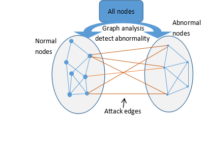

# 图分析技术
图数据广泛存在于我们的日常生活中，包括社交网络中好友关系、关注关系、点赞评论等， Web图中的网页链接关系、用户点击浏览、收藏网页等，电商平台中用户对商品的收藏、加购物车、购买、评分等行为，音乐视频网、电影评分网中用户听歌、看视频，加喜欢，评论点赞回复等，以及蛋白质分子网、交通网络和路由网络等等。对这些图数据加以分析，我们得到很多有用的信息，例如对社交网络的分析，我们可以进行个性化的好友推荐；对Web网页链接关系分析，得到搜索引擎的网页搜索和排序；对电商平台中用户行为分析，可以对其进行个性化的商品推荐等等。  

  
对于图数据的分析处理，我们可以大致分成上图的分层架构，上层是一些图算法及其支持的图应用，下层是对图数据的存储支持以及图计算的通用计算模型。所以我们研究内容也分为下面两个方向。

## 研究内容一 图计算
**随机游走采样加速**：随机游走因为具有良好的理论分析基础以及实现简单的原因，被广泛应用于对大规模在线社交网络的采样中。然而，由于随机游走在社交网络上收敛速度较慢和收敛速度不稳定，导致基于随机游走的在线社交网络采样效率受到严重 制约。本研究提出通过利用随机游走访问路径上的历史节点邻居信息加快其收敛速度的策略。基于如何利用历史节点信息的分析，本研究提出了一种基于公共邻居感知的随机游走算法 (CNARW)。该算法的主要思想是利用局部的邻居信息打破随机游走在选择下一跳时的随机均匀性进而设计一种带权的随机游走。这种带权的随机游走在选择下一跳时会优先选择和当前节点公共邻居较少且自身邻居数目较大的候选节点。随后为了保证 CNARW 能够适用于无偏的图采样。实验结果表明，CNARW算法相比于当前最杰出的两个算法不仅有更快的收敛速度(最大能快 71.9%) 而且收敛速度也更加稳定。在利用 CNARW 算法对在线社交网络做无偏采样时，本研究在理论保证下又分别设计了针对节点属性和拓扑属性的无偏估计算法。通过在真实数据集上的具体实验，发现相比于当前最杰出的两个算法，基于CNARW 的采样算法最 多能节省35.7%的访问开销。进一步，为了验证算法在真实场景中的适用性，本研究从两个具体的应用出发，通过实验发现均有较好的估计效果。

  

**Graphlet（图元）统计**:
Graphlets(图元)是指大规模网络中那些节点数目较少的连通诱导子图，在社交网络和生物信息学等领域有着广泛的应用。随着graphlets节点数目的增多，graphlets的种类数增长迅速且结构变化复杂，快速估计大规模社交网络中所有graphlets的频率是一项挑战。由于精确计数的计算成本较高，目前大多用基于随机游走的采样算法来近似估计graphlets的频率，而这些算法大多只能估计不超过5个节点的graphlets，很难扩展到高阶graphlets。因此，设计一个估计精度高且能扩展到估计高阶graphlets频率的采样算法具有重要的研究意义。我们提出了一种基于最大公共子结构感知的社交网络graphlets采样算法CSRW(Common Substructure based graphlets sampling via Random Walk)。给定graphlets的节点数k，CSRW首先感知并游走一个所有k-graphlets都共享的最大公共子结构2-path，再从多个节点的邻居中随机生成下一跳节点，直至得到k-graphlets样本，从而以统一的方式估计所有类型k-graphlets的频率。综合性实验表明，CSRW能统一地估计所有k-graphlets类型，其算法精确性优于当前代表性算法SRW2CSS和WRW；6, 7-graphlets的估计结果也证明了CSRW的可扩展性。CSRW2也以统一的框架估计所有k-graphlets的频率(k=4, 5)，且相对CSRW来说，CSRW2更有利于估计那些出现较少、结构较稠密的graphlets。

**影响力最大化问题**:
影响力最大化算法是在一个社交网络中寻找一组节点，使其能够在相应的影响力传播模型下能够影响更多的节点，传统的影响力最大化算法仅仅是适用于社交网络。对于社交活动网络的影响力最大化算法，我们主要是通过将一个社交活动网络等效为一个超图，并利用超图上的随机游走，定义影响力中心性指标，最终根据影响力中心性指标设计出简单贪心算法。最后利用中心性指标的子模特性，优化算法，最终该算法的时间复杂度能降低到线性时间复杂度。

**网络异常检测**:  
  
基于图分析中的random walk 实现对共识机制网络中异常行为的检测与防御。已知点对点和其他分级、分布式系统中是特别容易受到sybil攻击，在sybil攻击中，恶意用户通过虚构多个虚假身份来伪装成系统多个不同节点，通过控制共识机制网络及系统中的大多数节点来“投票”出诚实用户，打破以前防范恶意行为机制。为此对于共识机制网络中异常行为sybil的检测与防御,我们主要通过基于图顶点及子图的相关特征顶点度数、聚类系数等特征变量和传播概率模型中随机游走的结合来实现对异常节点的检测与防御。

## 研究方向二 图系统
**基于磁盘的随机游走图系统**:  
  
近些年来，大数据的研究非常火热，而大图分析是其中一个重要分支。随着图规模的不断增大，图不能放进一个单机的内存，针对这个问题，目前有两种解决路径：1. 基于集群的处理，即将图信息分布存储在多个机器，利用分布式算法来计算。2. 单个机器的处理，即利用单个机器的外部存储设备来存储图信息。第二种方法，由于其经济实用性，很多研究工作者对此展开研究工作。  
随机游走是图上很重要的一类算法，广泛应用在我们的实际生活中，比如搜索引擎中的网页排序，图片的自动字幕，图采样，以及社交网络中的好友推荐或音乐电影的推荐等。所以能够实现图上的快速随机游走有着十分重要的意义。  
下图所示的是现有的基于磁盘的图处理系统，他们都是针对通用的图算法，对随机游走来说可能会有一些实现或者效率上的问题，所以如何设计实现专门的图系统来实现图上的快速随机游走是我们目前的一个研究课题

